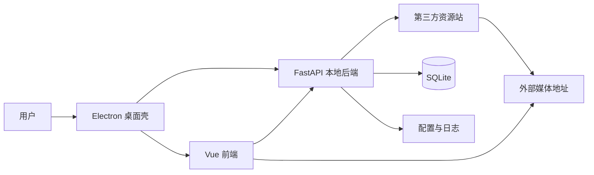

# VideoSearch v0.1.0

VideoSearch 是一款本机运行的视频聚合搜索桌面应用。它通过 Electron 启动本地 FastAPI 服务，由 Vue 界面并发检索多个已启用资源站，统一展示视频详情和播放线路，并在本机保存搜索历史、收藏、观看进度、日志与监控数据。

> 当前桌面打包支持 **macOS** 与 **Windows**。macOS 产物按构建机 CPU 架构生成；Windows 应在 Windows 主机或 CI runner 上构建。

## 核心能力

- **多源搜索**：按启用站点并发搜索，逐站展示搜索中、成功或失败状态，失败站点可单独重试。
- **视频详情**：统一整理海报、简介、演职员、年份、评分、状态和按线路分组的剧集。
- **视频播放**：基于 Artplayer 与 HLS.js 播放 HLS 或普通媒体地址，支持线路/剧集切换、倍速、画中画、全屏和自动连播。
- **个人数据**：在本地保存搜索历史、收藏和观看位置，并在首页提供继续观看入口。
- **资源站管理**：支持站点增删改、启停、单站/批量连接测试，以及配置导入导出。
- **日志与监控**：支持日志筛选、分页、详情、JSON/CSV 导出和清理，并聚合请求趋势、站点性能、热门关键词和健康状态。
- **桌面编排**：Electron 自动启动后端、等待健康检查、处理启动失败重试，并提供无边框窗口控制。

## 系统结构



- Electron 负责桌面窗口和本地后端进程生命周期。
- Vue 前端负责页面交互、并发搜索状态、播放器和数据可视化。
- FastAPI 后端负责资源站配置、外部请求、数据适配、个人数据和日志统计。
- SQLite 与本地文件保存单机用户数据，不依赖远程账号服务。

## 技术栈

版本约束来自当前依赖清单；实际锁定版本见对应 lock 文件或[模块说明文档](./doc/模块说明文档.md)。

| 范围 | 技术 |
|---|---|
| 桌面端 | Electron `^43.2.0`、electron-builder `^26.15.3`、electron-updater `6.8.9` |
| 前端 | Vue `^3.5.13`、Pinia `^3.0.1`、Vue Router `^4.5.0`、Axios `^1.7.9` |
| 播放与图表 | Artplayer `^5.4.0`、HLS.js `^1.5.20`、ECharts `^5.5.1` |
| 样式与构建 | Tailwind CSS `^3.4.17`、Vite `^6.0.7`、FontAwesome 6 |
| 后端 | Python `>=3.11`、FastAPI `>=0.115.0`、Uvicorn `>=0.30.0` |
| 数据与外部请求 | SQLAlchemy `>=2.0.51`、SQLite、HTTPX `>=0.27.0` |
| 环境与打包 | uv、Pydantic Settings、PyInstaller、electron-updater、NSIS |

## 项目结构

```text
LocalVideoSearch/
├── backend/                 # FastAPI 后端、SQLite 数据层和 PyInstaller 入口
│   ├── app/
│   ├── entry.py
│   ├── pyproject.toml
│   └── uv.lock
├── electron/                # Electron 主进程与 preload 安全桥接
├── frontend/                # Vue 3 前端及 Vite/Tailwind 配置
├── resources/               # 首次运行使用的默认资源站配置
├── doc/                     # 项目结构导航和业务模块说明
├── 规范文档/                # 前后端开发规范入口
├── package.json             # Electron 启动与 macOS/Windows 打包配置
└── README.md
```

完整目录职责和逐文件说明见[项目结构导航文档](./doc/项目结构文档.md)。

## 环境要求

请先安装：

- Node.js 与 npm（项目未固定具体版本）
- Python 3.11 或更高版本
- [uv](https://docs.astral.sh/uv/)

开发态后端虚拟环境必须位于 `backend/.venv/`。Electron 会按平台查找：

- Windows：`backend/.venv/Scripts/python.exe`
- macOS / Linux：`backend/.venv/bin/python`

## 安装依赖

在项目根目录执行：

```bash
npm install
npm --prefix frontend install
uv sync --directory backend --group build
```

三条命令分别安装 Electron、前端和 Python 后端依赖。

## 开发运行

### 一键启动

依赖安装完成后：

**macOS**

```bash
./start-dev.command
```

> `start-dev.command` 会先尝试结束占用 `4739`、`4740` 端口的进程，再启动 Vite 和 Electron。执行前请确认这些端口上没有其他需要保留的服务。

**Windows**

```bat
start-dev.bat
```

两个脚本都会先启动前端开发服务，再启动 Electron；Electron 会自动启动本地 FastAPI 后端。

### 手动启动

使用两个终端，在项目根目录分别执行：

```bash
# 终端 1：前端开发服务
npm --prefix frontend run dev
```

```bash
# 终端 2：Electron；会自动启动后端
npm run electron
```

### 单独调试后端

```bash
uv run --directory backend uvicorn app.main:app \
  --host 127.0.0.1 \
  --port 4740 \
  --reload
```

Windows 也可以运行 `start-backend.bat`。单独打开前端而不启动 Electron 时，需要同时运行此后端服务。

## 端口与运行配置

| 服务 | 默认地址 | 说明 |
|---|---|---|
| Vite 开发服务 | `http://127.0.0.1:4739` | 仅开发态使用 |
| FastAPI 本地服务 | `http://127.0.0.1:4740` | Electron 启动后端并等待健康检查通过 |

后端支持通过环境变量或 `backend/.env` 覆盖配置；Electron 桌面模式会明确传入固定主机、端口和应用数据目录。

| 配置项 | 默认值 | 适用范围 |
|---|---|---|
| `API_HOST` | `127.0.0.1` | 后端监听地址；桌面模式固定为本机回环地址 |
| `API_PORT` | `4740` | 后端端口；桌面模式固定使用该端口 |
| `APP_DATA_DIR` | 按平台推导 | 配置、数据库和日志的可写目录 |
| `VITE_API_BASE_URL` | `http://127.0.0.1:4740` | 不通过 Electron 运行前端时的后端地址 |

普通接口使用统一响应结构：

```json
{
  "code": 0,
  "message": "success",
  "data": {}
}
```

`code === 0` 表示业务成功；日志文件下载直接返回二进制响应，不使用该响应壳。

## 应用数据

开发脚本和打包软件统一使用 Electron 的 `userData` 目录，目录名固定为 `VideoSearch`：

| 系统 | 典型目录 |
|---|---|
| Windows | `%APPDATA%\VideoSearch\` |
| macOS | `~/Library/Application Support/VideoSearch/` |
| Linux | Electron 的应用数据目录下 `VideoSearch/` |

单独运行后端且未设置 `APP_DATA_DIR` 时，Linux 默认使用 `~/.local/share/VideoSearch/`。

```text
VideoSearch/
├── resource_sites.json      # 用户可写的资源站配置
├── video_search.db          # 搜索历史、收藏和播放记录
└── logs/
    ├── video_search.log     # 当前 JSON Lines 日志
    └── video_search.log.*   # 轮转备份（存在时）
```

默认站点来自项目内的 `resources/resource_sites.json`。首次需要配置时会复制到用户数据目录，之后的增删改、启停和导入操作只修改用户副本。

旧开发目录 `videosearch-desktop` 首次启动时会迁移可识别的业务文件；目标目录已有同名文件时以目标目录为准，旧目录随后直接删除，不保留备份。

## 可用脚本

### 根目录

| 命令 | 作用 |
|---|---|
| `npm run electron` | 启动 Electron，并自动编排本地后端 |
| `npm run build:frontend` | 构建前端生产文件 |
| `npm run build:backend` | 使用当前平台的 PyInstaller 构建后端可执行文件 |
| `npm run dist:mac` | 构建 macOS DMG 与 ZIP 产物 |
| `npm run dist:dir` | 构建 Windows 免安装目录版 |
| `npm run dist:win` | 构建 Windows NSIS 安装包 |

### 前端

| 命令 | 作用 |
|---|---|
| `npm --prefix frontend run dev` | 启动 Vite 开发服务 |
| `npm --prefix frontend run build` | 构建前端生产文件 |
| `npm --prefix frontend run preview` | 预览前端构建结果 |
| `npm --prefix frontend run lint` | 检查前端 JavaScript 与 Vue 文件 |

## 桌面打包

`npm run build:backend` 会清理旧的 PyInstaller 输出，并按当前构建机平台生成后端可执行文件。打包阶段使用 `--publish never`，只生成本地制品，不会自动上传 Release。

### macOS

macOS 应在 macOS 主机或对应 CI runner 上执行：

```bash
npm run dist:mac
```

会生成 DMG 与 ZIP，产物写入 `release/`，文件名包含版本和构建机 CPU 架构。CI 保留签名/公证环境变量入口；未提供对应 Secrets 时仍会生成未签名、未公证包，首次打开可能需要在系统安全设置中允许。macOS 自动更新使用内置免签名更新器，不依赖 Squirrel.Mac 的代码签名校验，但首次安装仍受 Gatekeeper 安全策略影响。

### Windows

Windows 应在 Windows 主机或 Windows CI runner 上执行，因为 PyInstaller 生成当前平台的后端程序：

```bash
# 免安装目录版
npm run dist:dir

# NSIS 安装包
npm run dist:win
```

目录版启动文件为 `release/win-unpacked/VideoSearch.exe`，必须分发完整的 `win-unpacked` 目录；NSIS 安装包写入 `release/`，安装时允许选择目录并创建桌面与开始菜单快捷方式。

### 构建顺序与资源映射

1. Vite 生成前端生产文件。
2. PyInstaller 生成当前平台后端：macOS 为 `backend/dist/backend`，Windows 为 `backend/dist/backend.exe`。
3. electron-builder 将桌面代码、前端产物、后端程序和默认资源组装到 `release/`。

| 源路径 | macOS 打包后位置 | Windows 打包后位置 |
|---|---|---|
| `backend/dist/backend` / `backend/dist/backend.exe` | `resources/backend/backend` | `resources/backend/backend.exe` |
| `frontend/dist/` | `resources/frontend/dist/` | `resources/frontend/dist/` |
| `resources/` | `resources/resources/` | `resources/resources/` |

打包后运行不依赖用户本机的 Python 虚拟环境。由于 PyInstaller 不负责跨平台编译，不能把 macOS 构建机的后端直接当作 Windows 发布包；跨平台发布应使用各自原生 runner。

### CI 发布

`.github/workflows/desktop-release.yml` 会在 macOS x64、macOS arm64 和 Windows x64 原生 runner 上构建制品，并在发布前合并两个 macOS 架构的更新元数据。推送与 `package.json` 版本一致的 tag（例如 `v0.1.0`）后，Workflow 会校验版本、上传制品并创建 GitHub Release；手动运行 Workflow 只生成 Actions artifacts。

CI 可选读取以下 Secrets：`MACOS_CSC_LINK`、`MACOS_CSC_KEY_PASSWORD`、`APPLE_ID`、`APPLE_APP_SPECIFIC_PASSWORD`、`APPLE_TEAM_ID`、`WINDOWS_CSC_LINK`、`WINDOWS_CSC_KEY_PASSWORD`。

### 自动更新

打包环境启动后会自动检查 GitHub Releases。Windows 使用 `electron-updater`；macOS 使用免签名自定义更新器：通过 GitHub Releases API 获取 `latest-mac.yml`，按当前 CPU 架构选择 ZIP，流式下载并校验 SHA-512，再由独立 helper 等待主进程退出、校验 ZIP 路径和 Bundle ID/版本后完成替换、回滚与重启。缺少 SHA-512 时仅降级为 HTTPS 加完整文件大小校验，并记录原因。开发脚本不会检查线上更新。

发布时必须同时上传安装包、ZIP、`latest.yml`/`latest-mac.yml` 和 blockmap 文件；`latest-mac.yml` 必须同时包含 macOS x64 与 arm64 的 ZIP 资产。自动更新不能替代首次安装的代码签名和公证，未签名包首次打开仍可能需要用户在系统安全设置中允许。

## 数据与外部依赖说明

- 搜索关键词会发送到用户启用的第三方资源站；视频播放会直接访问第三方媒体地址。
- 搜索历史、收藏、观看记录、配置和日志保存在本机，不提供账号、云同步或多用户隔离。
- 日志可能包含搜索关键词、资源站地址、耗时和错误信息，但当前不会自动上传到远程服务。
- 收藏和观看记录只保存关键词，不保存原搜索页码；来自后续结果页的视频在回访时可能无法重新定位。
- 第三方接口结构、服务可用性和媒体地址均不受本项目控制；单站失败不会阻断其他站点。
- 当前播放器不提供 DRM、字幕管理或离线下载能力。

## 常见问题

### 开发态提示找不到后端 Python

确认已执行：

```bash
uv sync --directory backend
```

并检查平台对应的虚拟环境解释器是否存在：

```text
backend/.venv/Scripts/python.exe   # Windows
backend/.venv/bin/python           # macOS / Linux
```

### 打包时提示 `Backend executable not found`

先构建当前平台的后端：

```bash
npm run build:backend
```

macOS 应确认 `backend/dist/backend` 存在，Windows 应确认 `backend/dist/backend.exe` 存在，然后再运行对应的 Electron 打包命令。

### Electron 打开后无法加载开发页面

确认 Vite 已在 `127.0.0.1:4739` 运行，再执行 `npm run electron`。

### 自动更新不弹出

自动更新只在打包版本启用。确认 GitHub Release 中存在当前平台对应的安装包、`latest.yml` 或 `latest-mac.yml` 及 blockmap 文件；macOS 还要确认 `latest-mac.yml` 同时包含当前架构的 ZIP，Windows 则继续要求 NSIS 更新资产。开发脚本不会弹出更新提示。

### 后端健康检查超时或端口占用

桌面模式固定使用 `127.0.0.1:4740`。停止占用该端口的进程后重试；macOS 一键脚本会主动尝试清理该端口。

### 打包后页面空白或静态资源加载失败

前端构建必须使用相对资源基址。检查 Vite 配置中的 `base` 是否仍为 `./`，并确认 `frontend/dist/` 已完整打入应用资源目录。

### 某个资源站搜索或测试失败

先在设置页单独测试该站点。超时、异常状态、无法解析的数据或反爬页面只会标记该站点失败，不影响其他站点。

## 相关文档

- [项目结构导航文档](./doc/项目结构文档.md)：绝对路径、目录职责、逐文件功能和问题定位入口。
- [模块说明文档](./doc/模块说明文档.md)：业务功能、模块边界、依赖关系和典型闭环。
- [后端规范文档](./规范文档/后端规范文档.md)：Python/FastAPI 开发规范入口。
- [前端规范文档](./规范文档/前端规范文档.md)：Vue JavaScript 开发规范入口。
