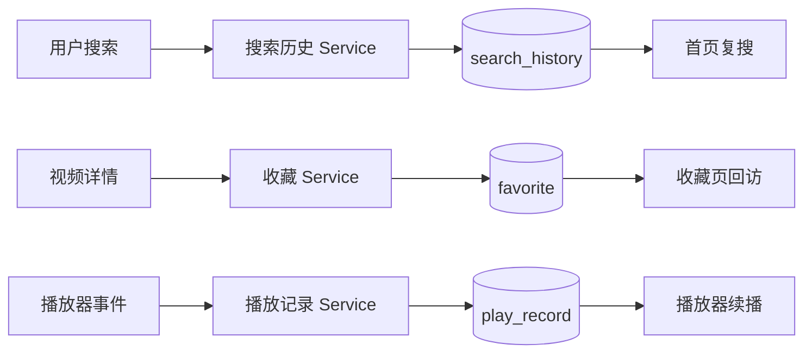

# 个人数据模块开发设计

> 本文档针对 VideoSearch 中的个人数据模块，描述搜索历史、收藏和播放记录的本地持久化、事务、唯一性和跨业务调用边界。

---

## 1. 需求

### 1.1 模块目标

个人数据模块为单机单用户提供复搜、回访和续播能力，在本地保存搜索历史、视频收藏快照和最新观看进度。三类数据共享 SQLite 连接和事务基础设施，但保持独立的业务服务、接口和生命周期，避免把不同语义合并成一个长期增长的“用户数据 Service”。

### 1.2 已确认事实

- 数据库由 `backend/app/db/database.py` 创建 SQLAlchemy SQLite Engine 和每请求 Session，连接启用 WAL 与外键约束；启动时 `init_db()` 调用 `Base.metadata.create_all()`。
- 搜索历史模型是 `backend/app/models/search_history.py`，关键词唯一，记录累计搜索次数和创建/更新时间；服务为 `backend/app/services/history.py`。
- 收藏模型是 `backend/app/models/favorite.py`，以 `(site_id,vod_id)` 唯一，保存标题、海报、类型、备注和搜索关键词快照；服务为 `backend/app/services/favorites.py`。
- 播放记录模型是 `backend/app/models/play_record.py`，以 `(site_id,vod_id)` 唯一，保存线路、剧集、位置、时长、标题、海报和关键词；服务为 `backend/app/services/play_records.py`。
- API 入口分别是 `history.py`、`favorites.py` 和 `play_records.py`；前端调用分散在 `Home.vue`、`VideoDetail.vue`、`VideoPlayer.vue` 和 `Favorites.vue`。
- 当前个人数据 API 已统一使用 POST；列表、详情、写入、删除和清空均通过明确 Request Schema 的 JSON Body 传参。
- 个人数据仅保存在本机，不提供账号、多用户、云同步、跨设备恢复和完整观看轨迹。

### 1.3 功能需求

#### 搜索历史

1. 搜索提交时记录去除首尾空格后的关键词。
2. 已存在关键词累计 `search_count` 并刷新 `updated_at`；新关键词创建一条记录。
3. 按最近更新时间返回历史，支持单条删除和清空全部。
4. 历史写入失败不阻断当前第三方搜索，页面可在下次聚焦时重新加载。

#### 收藏

1. 在详情页查询某站点/视频是否已收藏。
2. 以站点和视频组合判断重复收藏，重复添加幂等返回已有快照。
3. 保存标题、海报、类型、备注和搜索关键词，收藏页按创建时间倒序分页。
4. 支持取消单条收藏，删除不存在的记录返回可理解错误。

#### 播放记录

1. 以站点和视频组合保存一条最新观看状态。
2. 写入或更新当前线路、剧集索引、剧集名称、播放位置和总时长，并刷新最近更新时间。
3. 首页展示最近观看记录，播放器按站点/视频查询并在匹配线路和剧集时续播。
4. 支持删除单条记录和清空全部记录；不保存逐次播放历史。

### 1.4 非功能需求

- **事务一致性**：一个写入用例由 Service 拥有提交边界；提交失败必须回滚，不能返回半更新数据。
- **并发**：SQLite 使用 WAL 支持读写并发，但写入仍是单写者；组合唯一约束必须由数据库最终保证，不能只依赖前端去重。
- **隐私**：关键词、标题、海报 URL、播放线路和位置仅保存于本机；日志不得记录完整敏感请求体。应用数据目录由 Electron/后端配置提供，个人数据模块不自行推导另一套路径。
- **可靠性**：数据库连接失败、唯一约束冲突和记录不存在分别映射为基础设施、冲突或数据不存在错误；不向客户端返回 SQL、堆栈或本地路径。
- **性能**：列表必须有界分页或固定条数；查询按业务排序使用索引/唯一约束，避免无界读取。

### 1.5 范围与职责边界

**本模块负责**：三类个人数据的 Schema、SQLite 模型、查询/写入/删除事务、分页和本地生命周期。

**本模块不负责**：账号认证、用户身份、云同步、数据导出、第三方视频实时同步、站点配置、搜索缓存、播放器实例和日志文件清理。前端 Store/页面负责交互状态，后端 Service 负责数据事实和事务。

**设计假设**：应用继续单机单用户运行，所有记录不需要 `user_id`；若未来支持多用户，必须在表、唯一键、查询和 API 授权边界中引入身份维度，不能只在前端隐藏数据。

### 1.6 验收标准

- 关键词重复记录会累加次数并更新最近时间，列表按最近使用顺序返回。
- 收藏和播放记录以 `(site_id,vod_id)` 去重，不同站点的相同视频 ID 不互相覆盖。
- 播放记录写入相同数值也刷新 `updated_at`；读取不存在的播放记录返回 `data: null`。
- 单条删除、清空和写入失败均保持数据库事务完整；列表分页总数和页码正确。
- 首页、详情、播放器和收藏页能通过统一 API 完成历史、收藏和续播闭环；本地数据库路径和数据范围符合应用数据目录约定。

## 2. 该项目的模块结构与流程

### 2.1 模块关系

- **调用方**：视频搜索写入搜索历史；视频详情查询/写入收藏；播放器查询/更新播放记录；首页读取历史和最近播放；收藏页读取/删除收藏。
- **内部基础设施**：API Router → Pydantic Schema → Service → SQLAlchemy Model/Session；数据库 Session 由 `get_db()` 注入并在请求结束关闭。
- **被依赖能力**：个人数据结果被前端路由用于复搜、详情回访和播放器定位；系统日志只记录操作/错误，不读取个人数据库作为监控事实。
- **不应越界**：页面不能直接操作 SQLAlchemy；搜索服务不能绕过历史 Service 直接写表；播放器不能直接提交数据库 Session。

### 2.2 当前代码边界

| 子模块 | API | Service | Model | 前端调用 |
|---|---|---|---|---|
| 搜索历史 | `backend/app/api/v1/history.py` | `services/history.py` | `models/search_history.py` | `api/history.js`、`Home.vue` |
| 收藏 | `backend/app/api/v1/favorites.py` | `services/favorites.py` | `models/favorite.py` | `api/favorites.js`、`VideoDetail.vue`、`Favorites.vue` |
| 播放记录 | `backend/app/api/v1/play_records.py` | `services/play_records.py` | `models/play_record.py` | `api/playRecords.js`、`Home.vue`、`VideoPlayer.vue` |
| 公共数据层 | `db/database.py`、`schemas/response.py` | `commit_or_rollback()` | `Base`/SQLite | `utils/request.js` |

当前 Service 通过 `commit_or_rollback(db)` 提交并在失败时回滚；辅助查询不另行提交。**设计建议**：保持这个边界，同时将数据库异常和唯一冲突的公开错误分类收敛，避免每个 Router 重复 `try/except`。

### 2.3 核心业务流程

1. 搜索 Store 发起站点搜索，同时异步调用记录关键词；历史失败只记录/忽略，不取消搜索。
2. 详情页加载收藏状态，以站点和视频 ID 查询；用户添加时提交快照，已存在则直接返回已有记录；取消时按记录 ID 删除。
3. 播放器加载详情后按站点和视频查询播放记录；只有线路名和剧集索引匹配时设置待跳转位置。
4. 播放器按时间节流、暂停、切换和离开页面调用 upsert；后端在一个 Session 事务内更新或新增并刷新时间。
5. 首页和收藏页按时间排序分页读取；删除后根据当前页是否为空决定是否退回上一页。

### 2.4 状态、异常、事务和并发规则

- 每个请求一个 SQLAlchemy Session；Session 不跨前端并发 Task 或后台任务共享。
- Service 是事务所有者：读取、修改/删除、提交、刷新在同一业务边界内完成；列表查询不产生写事务。
- 当前模型没有外键，因为站点配置和第三方视频不是 SQLite 事实表；删除资源站不会级联删除收藏或播放快照，符合“快照独立保留”的业务边界。
- 唯一冲突可能发生在并发收藏/播放写入；数据库唯一约束是最终防线，捕获 `IntegrityError` 后应回滚并按幂等/冲突策略重新读取或返回业务错误。
- 删除和清空是高影响本地操作；界面必须二次确认（当前收藏单条删除没有统一确认，需按产品风险决定是否补齐），服务不自动执行数据清理。

### 2.5 实施顺序

1. 固定三个 Model 的字段、唯一约束、排序和分页契约。
2. 统一 Request/Response Schema 与数据库异常映射，保留当前服务职责。
3. 公开 API 与前端调用已统一为 POST-only Request Schema，查询、写入、删除和清空均通过 JSON Body 传参；旧方法不保留。
4. 后续补齐播放卸载写入、收藏删除确认和并发重复提交验证；最后按授权流程处理已有数据库 Schema 变化。

## 3. 数据库的设计

### 3.1 数据库与连接方式

使用 SQLite，路径由 `settings.DATABASE_PATH` 计算，默认位于平台应用数据目录下的 `video_search.db`。SQLAlchemy Engine 使用 `check_same_thread=False`，连接事件启用：

- `PRAGMA journal_mode=WAL`：允许读写并发时减少读阻塞。
- `PRAGMA foreign_keys=ON`：即使当前模块没有业务外键，也保持统一约束行为。
- 每个 Web 请求通过 `SessionLocal` 创建独立 Session，`get_db()` 在结束时回滚未处理异常并关闭。

### 3.2 实体与字段

#### `search_history`

| 字段 | 类型 | 可空/默认 | 约束与用途 |
|---|---|---|---|
| `id` | SQLite Integer（SQLAlchemy BigInteger 在 SQLite 使用 Integer） | 非空，自增 | 主键 |
| `keyword` | String(100) | 非空 | UNIQUE + index；规范化后的搜索关键词 |
| `search_count` | Integer | 非空，默认 1 | 累计搜索次数 |
| `created_at` | DateTime | 非空，数据库当前时间 | 首次记录时间 |
| `updated_at` | DateTime | 非空，数据库当前时间/更新时刷新 | 最近使用排序 |

#### `favorite`

| 字段 | 类型 | 可空/默认 | 约束与用途 |
|---|---|---|---|
| `id` | SQLite Integer 自增 | 非空 | 主键 |
| `site_id` | String(50) | 非空 | 资源站标识；当前有单列索引 |
| `vod_id` | String(50) | 非空 | 第三方视频标识 |
| `title` | String(200) | 非空 | 收藏时标题快照 |
| `thumbnail` | String(500) | 非空，默认空串 | 海报快照 |
| `type_name` | String(50) | 非空，默认空串 | 类型快照 |
| `remarks` | String(100) | 非空，默认空串 | 状态/更新备注快照 |
| `keyword` | String(100) | 非空 | 回访详情所需搜索关键词 |
| `created_at` | DateTime | 非空，数据库当前时间 | 收藏时间 |
| `updated_at` | DateTime | 非空，数据库当前时间/更新时刷新 | 预留的更新时间 |

唯一约束：`uq_favorite_site_vod(site_id, vod_id)`。列表按 `created_at DESC`，详情状态按组合键查询。

#### `play_record`

| 字段 | 类型 | 可空/默认 | 约束与用途 |
|---|---|---|---|
| `id` | SQLite Integer 自增 | 非空 | 主键 |
| `site_id` | String(50) | 非空 | 资源站标识；当前有单列索引 |
| `vod_id` | String(50) | 非空 | 第三方视频标识 |
| `title` | String(200) | 非空 | 播放记录标题快照 |
| `thumbnail` | String(500) | 非空，默认空串 | 海报快照 |
| `keyword` | String(100) | 非空 | 重新定位详情所需关键词 |
| `line_name` | String(100) | 非空，默认空串 | 最近播放线路 |
| `episode_index` | Integer | 非空，默认 0 | 当前线路剧集索引 |
| `episode_name` | String(100) | 非空，默认空串 | 剧集名称快照 |
| `position_seconds` | Integer | 非空，默认 0 | 最近播放位置，秒 |
| `duration_seconds` | Integer | 非空，默认 0 | 媒体总时长，秒 |
| `created_at` | DateTime | 非空，数据库当前时间 | 首次观看时间 |
| `updated_at` | DateTime | 非空，数据库当前时间/更新时刷新 | 最近观看排序 |

唯一约束：`uq_play_record_site_vod(site_id, vod_id)`。列表按 `updated_at DESC`，详情按组合键查询。

### 3.3 事务、索引和查询规则

- 搜索历史记录是一个 upsert 用例；计数加一与更新时间刷新必须在同一事务中完成。
- 收藏创建是幂等用例；先按组合键查询，新增时依靠唯一约束兜底；取消收藏按主键删除。
- 播放记录 upsert 在同一事务内更新全部快照字段和 `updated_at`；即使位置不变也必须刷新时间。
- 分页列表先统计总量，再按排序字段 offset/limit 查询；当前页面上限由 Schema 限制为 100，历史固定返回最近条数。
- 组合唯一约束同时提供去重和组合查询索引；后续若数据规模扩大，应根据 `EXPLAIN QUERY PLAN` 再评估 `(updated_at)` 或复合排序索引，不无条件堆加索引。

### 3.4 生命周期、备份、删除和结构变化

数据长期保留到用户主动删除、清空或应用数据被用户清理；当前没有自动过期策略。数据库文件、WAL 文件和日志属于应用数据目录的一部分，备份/导出能力不在本模块范围内。

项目开发期按当前 Model 直接建表，不创建迁移目录、版本表或兼容代码。结构变化时只更新 Model 和初始化定义；若需要删除/覆盖现有数据库，必须先向用户说明绝对路径、数据损失范围、新 Schema 来源、重建步骤和检查方式，并获得明确授权。未授权时只修改设计/代码，不操作数据库文件。

## 4. API 接口的设计

### 4.1 统一契约

所有现行 HTTP 接口均使用 POST；旧 GET/PUT/DELETE 契约不保留。查询、列表、创建、更新、删除和清空通过业务动作路径与 Pydantic Request Schema 区分。普通响应使用 `ApiResponse[T]`；列表使用 `ApiResponse[PaginatedResponse[T]]`，字段为 `lists` 和 `pagination`。API 层调用 `success()`/`error()`，Service 不返回最外层响应壳。

### 4.2 搜索历史接口

| 接口 | 方法 | 请求 | 响应 |
|---|---|---|---|
| `/api/v1/history/list` | POST | `SearchHistoryListRequest`：`limit` | `ApiResponse[PaginatedResponse[SearchHistoryItemResponse]]` |
| `/api/v1/history/record` | POST | `SearchHistoryCreateRequest.keyword` | `ApiResponse[SearchHistoryItemResponse]` |
| `/api/v1/history/delete` | POST | `SearchHistoryDeleteRequest.history_id` | `ApiResponse[SearchHistoryDeleteResponse]` |
| `/api/v1/history/clear` | POST | `SearchHistoryClearRequest` | `ApiResponse[SearchHistoryDeleteResponse]` |

### 4.3 收藏接口

| 接口 | 方法 | 请求 | 响应 |
|---|---|---|---|
| `/api/v1/favorites/list` | POST | `FavoriteListRequest`：`page/page_size` | `ApiResponse[PaginatedResponse[FavoriteItemResponse]]` |
| `/api/v1/favorites/status` | POST | `FavoriteStatusRequest`：`site_id/vod_id` | `ApiResponse[FavoriteStatusResponse]` |
| `/api/v1/favorites/add` | POST | `FavoriteCreateRequest` | `ApiResponse[FavoriteItemResponse]` |
| `/api/v1/favorites/remove` | POST | `FavoriteDeleteRequest.favorite_id` | `ApiResponse[FavoriteDeleteResponse]` |

添加收藏的幂等键为 `site_id + vod_id`；成功重复提交返回现有记录，不创建重复行。

### 4.4 播放记录接口

| 接口 | 方法 | 请求 | 响应 |
|---|---|---|---|
| `/api/v1/play-records/list` | POST | `PlayRecordListRequest`：`page/page_size` | `ApiResponse[PaginatedResponse[PlayRecordItemResponse]]` |
| `/api/v1/play-records/detail` | POST | `PlayRecordDetailRequest`：`site_id/vod_id` | `ApiResponse[PlayRecordItemResponse \| None]` |
| `/api/v1/play-records/upsert` | POST | `PlayRecordUpsertRequest` | `ApiResponse[PlayRecordItemResponse]` |
| `/api/v1/play-records/delete` | POST | `PlayRecordDeleteRequest.record_id` | `ApiResponse[PlayRecordDeleteResponse]` |
| `/api/v1/play-records/clear` | POST | `PlayRecordClearRequest` | `ApiResponse[PlayRecordDeleteResponse]` |

### 4.5 权限、错误、前端调用和验收

当前应用无登录系统且只在本机回环地址提供接口，因此无用户级鉴权；未来开放远程访问前必须增加服务端身份和资源授权。参数校验由 Pydantic 负责长度、范围和结构；唯一冲突、记录不存在和数据库失败由 Service/集中异常边界映射。错误响应不暴露 SQL、堆栈、本地文件路径或第三方原始内容。

前端 `api/history.js`、`api/favorites.js`、`api/playRecords.js` 只负责端点和 snake_case DTO；`Home.vue`、`Favorites.vue`、`VideoDetail.vue`、`VideoPlayer.vue` 负责局部加载、提交、防重复、空态和错误反馈，不自行创建 Axios。验收覆盖正常、空数据、分页、重复提交、取消/清空、数据库异常、网络失败、播放卸载保存和路由回访。
