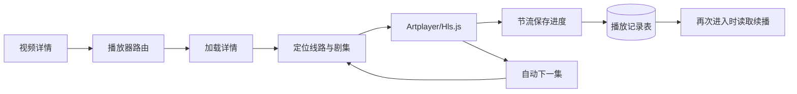

# 播放器模块开发设计

> 本文档针对 VideoSearch 中的播放器模块，描述线路/剧集选择、Artplayer 与 HLS 生命周期、播放偏好、自动连播和观看进度续播的实现边界。

---

## 1. 需求

### 1.1 模块目标

播放器模块为详情页提供可恢复的媒体播放体验：用户可以选择线路和剧集，播放 HLS 或普通媒体地址，调整音量和倍速，控制自动连播，并在退出后从匹配的线路与剧集继续播放。

### 1.2 已确认事实

- 页面入口为 `frontend/src/views/user/VideoPlayer.vue`，路由为 `/video/:siteId/:vodId/play`；线路、剧集、URL、标题和搜索上下文通过查询参数传入。
- 播放器使用 Artplayer `5.x` 和 Hls.js；通过 `customType.m3u8` 为 HLS 创建 Hls 实例，销毁 Artplayer 时销毁 Hls。
- 详情由 `useVideoStore` 加载，播放源以 `line -> episodes` 组织；切换线路/剧集会重建播放器并同步路由。
- 音量、倍速和自动连播偏好使用 `localStorage`，键分别为 `videosearch.player.volume`、`videosearch.player.rate` 和 `videosearch.player.autonext`。
- 播放进度每 10 秒、暂停、切换、播放结束和页面卸载时调用播放记录 upsert；播放记录服务按 `(site_id,vod_id)` 更新同一条记录。
- 当前播放器依赖的详情和播放记录 API 已统一使用 POST；播放器媒体地址仍由浏览器直接按第三方媒体协议请求。

### 1.3 功能需求

1. 加载详情并定位路由指定的线路、URL 或剧集索引。
2. 播放 HLS 和普通媒体地址，显示播放失败反馈。
3. 展示线路和当前线路剧集列表，允许线路与剧集切换。
4. 支持 Artplayer 提供的播放控制、倍速、快捷键、画中画和全屏。
5. 记住用户音量、倍速和自动连播偏好；偏好仅属于当前本机浏览器环境。
6. 播放过程中节流保存标题、海报、关键词、线路、剧集、位置和总时长。
7. 重新打开匹配的视频、线路和剧集时，在位置大于 5 秒的情况下提示续播。
8. 当前剧集结束且自动连播开启时进入下一集；线路集数不足时将索引限制在有效范围。
9. 离开页面前释放 Artplayer、Hls、事件监听和计时资源，避免媒体和内存泄漏。

### 1.4 非功能需求

- **媒体安全**：只接受明确的 HTTP(S) 媒体地址；不渲染不可信 HTML，不将第三方 URL 拼入可执行脚本。
- **资源可靠性**：线路或媒体地址失效只影响当前播放，提示用户切换线路/剧集；不自动无限切换来源。
- **进度一致性**：同一视频的保存必须使用稳定的站点与视频组合键；线路和剧集索引一起判断续播，不能跨线路复用位置。
- **并发**：进度保存可能与切换/卸载重叠，写入必须幂等；重复点击线路/剧集不产生多个播放器实例。
- **隐私**：播放地址、标题和关键词属于本机播放上下文；播放记录仅保存于本地数据库，不上传远程账号系统。

### 1.5 范围与职责边界

**本模块负责**：媒体实例生命周期、线路/剧集选择、路由同步、播放控制、偏好和进度写入触发。

**本模块不负责**：第三方资源站配置、视频详情字段映射、DRM、字幕管理、离线下载、媒体代理、云同步和完整观看轨迹。播放进度的持久化由个人数据模块的播放记录服务负责，详情数据由视频详情模块提供。

**设计假设**：当前应用只需要单个播放器页面、单机单用户和浏览器/Electron 支持的 HLS/普通媒体能力；若将来需要多窗口同步或多播放器，需要引入播放器会话标识，不能继续依赖单条播放记录。

### 1.6 验收标准

- 详情页进入播放器后能按 URL、线路名和剧集索引恢复正确媒体；路由刷新后仍能重新加载详情。
- HLS 支持环境创建并销毁 Hls，原生 HLS 环境不重复创建；普通媒体可交给 Artplayer 播放。
- 切换线路/剧集会销毁旧实例、更新路由并显示新剧集；播放失败有可恢复提示。
- 音量、倍速和自动连播刷新后保持；用户关闭自动连播时播放结束不跳集。
- 进度按节流策略写入，暂停/离开页面补写；续播只在站点、视频、线路和剧集都匹配时生效。

## 2. 该项目的模块结构与流程

### 2.1 模块关系

- **上游**：视频详情页提供 `site_id/vod_id/keyword/page` 和播放线路入口；路由传递可选 URL、线路和剧集。
- **本模块内部**：`VideoPlayer.vue` → `video` Store → 详情 API；播放器事件 → 播放记录 API → SQLite。
- **下游/协作**：外部媒体地址由浏览器直接访问；首页读取播放记录列表生成继续观看入口；桌面壳只提供 WebView 承载和本地后端地址。
- **不应反向依赖**：Artplayer 不直接访问后端数据库，播放记录服务不持有前端播放器实例。

### 2.2 当前代码边界

| 边界 | 当前实现 | 责任 |
|---|---|---|
| 路由 | `frontend/src/router/index.js` | 传递视频、线路、剧集和媒体 URL |
| 播放页 | `frontend/src/views/user/VideoPlayer.vue` | 播放器、线路/剧集选择、续播、自动连播和偏好 |
| 视频状态 | `frontend/src/stores/video.js` | 详情请求和播放源归一化 |
| 媒体实例 | Artplayer/Hls.js | 媒体加载、控制和事件 |
| 进度 API | `frontend/src/api/playRecords.js` | 进度查询和幂等写入 |
| 后端记录 | `backend/app/services/play_records.py`、`models/play_record.py` | 记录 upsert、列表、删除和清空 |

### 2.3 核心流程

1. 播放页先使用路由中的 URL 尝试建立播放器，同时请求详情；详情完成后按线路名、URL 或剧集索引校准当前选择。
2. 若存在匹配播放记录且位置大于 5 秒，保存为 `pendingSeek`，在媒体元数据可用后设置播放位置。
3. `currentPlayUrl` 变化时销毁旧 Artplayer，等待 DOM 更新，再创建新实例；HLS 自定义类型负责加载和销毁 Hls。
4. `timeupdate` 每 10 秒触发一次进度 upsert，暂停、线路/剧集切换和卸载时补写；结束时保存 0 位置并按设置进入下一集。
5. 线路或剧集变化后通过 `router.replace` 更新 URL，确保刷新和复制地址能够定位当前播放上下文。

### 2.4 状态、异常、并发和资源释放

- 当前线路取路由线路名，否则按 URL 匹配，再否则取第一条；当前剧集索引限制在当前线路有效范围。
- 播放器状态、详情加载状态和进度写入状态分离；当前代码进度写入采用 fire-and-forget，失败不阻断播放。**设计建议**：增加一个待写入快照和卸载前有限等待，防止快速退出丢失最后进度。
- `destroyPlayer()` 必须在 URL 变化和卸载前执行；Hls 事件、Artplayer 事件和 DOM 引用不能跨实例残留。
- 自动连播只在同一线路还有下一集时执行；线路切换时不把旧线路的进度当作新线路的续播。
- 播放失败不自动切换不确定的第三方地址，提示用户手动切换线路或剧集；网络失败不当作本地后端故障。

### 2.5 关键技术选择与实施顺序

使用 Artplayer 作为控制层、Hls.js 作为 HLS 适配层，沿用当前项目依赖，不新增媒体代理。实施顺序为：先固定线路/剧集 DTO 与路由参数，再保证播放器实例销毁和 HLS 清理，随后接入幂等进度写入和续播校验，最后验证卸载、快速切换和自动连播边界。

## 3. 数据库的设计

### 3.1 持久化结论

播放器模块不直接管理数据库表。它通过播放记录 API 读写 `play_record`，数据库结构、事务和删除责任属于个人数据模块；播放器只提交当前播放快照。

### 3.2 本地偏好和播放快照

| 数据 | 存储 | 字段/键 | 生命周期 |
|---|---|---|---|
| 音量 | `localStorage` | `videosearch.player.volume` | 浏览器本地长期保留，清理站点数据时删除 |
| 倍速 | `localStorage` | `videosearch.player.rate` | 浏览器本地长期保留 |
| 自动连播 | `localStorage` | `videosearch.player.autonext` | 浏览器本地长期保留，默认开启 |
| 观看进度 | SQLite `play_record` | 站点、视频、线路、集、位置、总时长等 | 直到用户删除/清空记录或数据库被清理 |

媒体 URL、Hls 缓存和 Artplayer 实例不落盘；第三方媒体地址失效时只重新从详情获取，不在本地建立下载文件。

### 3.3 一致性、并发和隐私

播放记录以 `(site_id, vod_id)` 唯一；同一视频不同线路和剧集覆盖同一条最新状态，这是当前产品“一个视频一条最新观看状态”的事实。写入由后端 Service 负责一个请求内的读取—更新/新增—提交事务，前端重复提交应保持幂等。

进度写入失败不能回滚当前播放，但必须提供日志/调试事实；页面退出时不应等待无限时长。用户可在继续观看入口删除单条记录或由个人数据模块清空全部记录。记录包含关键词、标题、海报和外部站点上下文，仅保存在本机。

### 3.4 结构变化

当前开发期没有数据库迁移链；如果增加线路标识、媒体类型或播放会话字段，更新当前 SQLAlchemy Model 和建表定义后按项目约定直接重建新数据库。删除或重建已有数据库前必须获得用户明确授权，不在播放器运行时自动执行。

## 4. API 接口的设计

### 4.1 现行统一契约

播放器没有独立的媒体 HTTP API，使用 POST 详情接口获取线路，并使用 POST 播放记录接口持久化进度；旧 GET/PUT/DELETE 契约不保留，查询、写入、删除和清空均使用 Request Schema Body。

### 4.2 现行调用边界

以下为播放器当前使用的后端接口契约；播放记录查询、写入、删除和清空均使用 POST JSON Body。

| 接口 | 方法 | Request Schema 关键字段 | 成功响应 |
|---|---|---|---|
| `/api/v1/videos/detail` | POST | `keyword`、`site_id`、`vod_id`、`page` | `ApiResponse[VideoDetailResponse]` |
| `/api/v1/play-records/detail` | POST | `site_id`、`vod_id` | `ApiResponse[PlayRecordItemResponse \| None]` |
| `/api/v1/play-records/upsert` | POST | `PlayRecordUpsertRequest` 全部播放快照字段 | `ApiResponse[PlayRecordItemResponse]` |

播放媒体地址不通过本地 API 代理，浏览器直接向第三方请求；播放器只把外部播放错误转为界面提示。播放记录 Service 不返回 `ApiResponse`，由 API 层使用统一成功/错误构造。

### 4.3 幂等、取消和错误

- `upsert` 的幂等键为 `(site_id,vod_id)`；重复进度提交更新同一记录，并刷新 `updated_at`。
- 进度写入属于非关键可恢复写入，前端不对失败请求无限重试；可在下一次节流点或暂停事件再次提交。
- 详情加载支持路由变化时丢弃旧结果；媒体切换不应继续使用旧播放器事件写入新线路。
- 参数错误包括空站点/视频/关键词、负位置或负时长；数据不存在时详情查询返回 `null` 而不是伪造记录；数据库失败返回统一内部错误。
- 当前无认证，服务端限定本地回环；未来多用户场景必须把播放记录资源边界与身份绑定，不能仅依赖前端路由。

### 4.4 前端实现与验收

`VideoPlayer.vue` 维护播放器私有状态和生命周期，`video` Store 管理详情，`api/playRecords.js` 只负责 DTO 映射和统一请求入口。所有定时器、媒体实例、事件监听和图表/DOM引用在卸载时清理。

验收包括：HLS/普通媒体、线路切换、剧集切换、自动连播关闭、偏好恢复、5 秒续播阈值、匹配/不匹配线路续播、暂停/卸载补写、重复 upsert、播放失败和快速路由切换。
