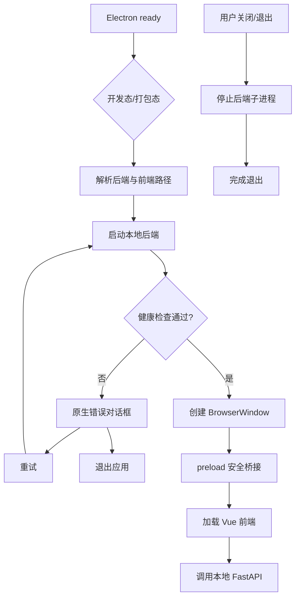

# 桌面运行编排模块开发设计

> 本文档针对 VideoSearch 中的桌面运行编排模块，描述 Electron 主进程、Vue 前端、本地 FastAPI 后端的启动、健康检查、窗口控制、受控桥接和退出清理设计。

---

## 1. 需求

### 1.1 模块目标

桌面运行编排模块把前端和本地后端组合成一个可使用的 VideoSearch 桌面应用。用户只需打开 Electron 应用，系统即可启动后端、等待健康检查通过、加载前端窗口，并在后端启动失败或应用退出时提供可恢复反馈和子进程清理。

### 1.2 已确认事实

- Electron 主进程入口是 `electron/main/index.js`，preload 是 `electron/preload/index.js`；根 `package.json` 将其声明为 Electron 主入口。
- 开发态后端由 Electron 以 `backend/.venv` 对应 Python 启动 `uvicorn app.main:app`；打包态执行 `resources/backend/backend.exe`。
- 固定本地地址为 `127.0.0.1:4740`；开发态前端由 Vite 提供 `127.0.0.1:4739`，打包态加载 `resources/frontend/dist/index.html`。
- Electron 通过环境变量传入 `API_HOST`、`API_PORT` 和 `APP_DATA_DIR`；应用数据目录为平台用户目录下的 `VideoSearch`，承载配置、SQLite 和日志。
- 主进程最多等待 15 秒，每 300 ms 请求 `/api/v1/health`；健康响应必须是 2xx 且业务 `code === 0` 才视为就绪。
- 窗口使用无边框 BrowserWindow、`contextIsolation: true`、`nodeIntegration: false`，preload 只暴露应用信息、后端地址/状态和窗口控制 IPC。
- 退出时 `before-quit` 阻止默认退出，等待后端子进程退出，最多等待 3 秒；窗口关闭/应用退出处理由主进程负责。
- 当前桌面打包目标是 Windows；macOS 提供开发脚本，未配置 macOS 安装包。

### 1.3 功能需求

1. 根据开发态/打包态选择正确的后端可执行文件、工作目录和前端加载方式。
2. 创建应用数据目录和日志目录，把运行数据写入用户可写位置而不是安装目录。
3. 启动本地后端并等待健康接口可用，后端未就绪前不创建业务窗口。
4. 后端可执行文件缺失、启动错误、端口占用或健康超时时显示原生错误对话框，支持重试或退出。
5. 向前端提供后端 base URL、后端状态和有限的窗口控制能力。
6. 支持无边框窗口的最小化、最大化/还原、关闭和最大化状态通知。
7. 应用退出时停止后端，防止子进程和端口残留；重复退出流程只执行一次。
8. 打包时把前端产物、后端可执行文件和默认资源站配置打入正确的 resources 目录。

### 1.4 非功能需求

- **安全**：保持上下文隔离、禁用渲染进程 Node 集成；IPC 通道使用白名单，不向前端暴露任意进程、文件系统或消息能力。
- **可靠性**：启动状态必须区分 stopped/starting/running/stopping/error；健康检查只判断本地服务可用，不调用第三方资源站。
- **生命周期**：后端进程、窗口、IPC 监听和退出回调必须避免重复注册或重复停止；重试前处理上一次残留状态。
- **可诊断性**：主进程记录后端 stdout/stderr 和启动错误，但用户对话框只显示安全、可理解的信息，不暴露令牌或完整内部堆栈。
- **兼容性**：开发态与打包态路径、Windows `.exe` 和 Unix Python 路径必须分别处理；前端使用相对资源基址以支持 `loadFile()`。

### 1.5 范围与职责边界

**本模块负责**：Electron 主进程生命周期、后端子进程、健康检查、窗口创建/控制、preload 安全桥接、前端加载和打包资源编排。

**本模块不负责**：搜索、资源站业务、SQLite 查询、日志统计、播放器、用户数据和第三方请求。后端业务配置/数据库路径由后端 Settings 接收，桌面模块只提供目录和启动参数，不直接读取业务数据库。

**设计假设**：当前应用单实例、固定端口、单窗口运行；如果需要多实例或动态端口，必须改变前端地址发现、健康检查和后端配置契约，不能只复制现有启动流程。

### 1.6 验收标准

- 开发态能找到 `backend/.venv` Python、启动 Uvicorn、健康检查成功后打开 Vite 页面；打包态能找到 `backend.exe` 和 `frontend/dist/index.html`。
- 后端启动失败、健康超时和资源缺失均显示重试/退出选项，重试不会产生重复后端进程或端口冲突。
- 前端只能通过 preload 暴露的白名单 API 获取后端地址和控制窗口，渲染进程不能直接访问 Node API。
- 应用退出后后端进程结束，重复触发退出不会无限阻塞；窗口最大化状态与主进程同步。
- 配置、数据库和日志写入用户应用数据目录；打包资源只读，默认配置首次复制后由后端管理。

## 2. 该项目的模块结构与流程

### 2.1 模块关系

- **上游**：操作系统和 Electron `app` 生命周期提供用户数据目录、资源路径和窗口能力。
- **本模块内部**：Electron 主进程 → 后端子进程/健康检查；主进程 ↔ preload IPC；前端通过 `desktopApi` 获取地址和窗口操作。
- **下游**：Vue 前端请求本地 FastAPI；FastAPI 再访问 SQLite、配置文件、日志和第三方资源站；桌面模块不参与这些业务调用。
- **打包协作**：根 `package.json` 的 electron-builder 配置把 `backend/dist/backend.exe`、`frontend/dist` 和 `resources` 映射到安装包 resources。

### 2.2 当前代码边界

| 边界 | 当前实现 | 责任 |
|---|---|---|
| Electron 主进程 | `electron/main/index.js` | 路径解析、后端 spawn、健康检查、窗口和退出 |
| preload | `electron/preload/index.js` | 受控 `contextBridge` API |
| 前端地址 | `frontend/src/utils/request.js` | 优先读取 `desktopApi.getBackendBaseUrl()`，浏览器环境回退 Vite 环境变量 |
| 前端窗口控件 | `frontend/src/App.vue` | 导航、窗口按钮和最大化状态监听 |
| 后端入口 | `backend/entry.py` / `backend/app/main.py` | 读取启动参数、初始化 FastAPI 资源 |
| 打包配置 | 根 `package.json` | Windows 目录版/NSIS 及 extraResources |
| 开发启动 | `start-dev.command`、批处理脚本 | 启动 Vite，Electron 再编排后端 |

### 2.3 核心流程

1. `app.whenReady()` 后调用 `ensureBackendOrShowError()`，根据是否打包选择后端根目录和可执行路径。
2. 计算应用数据目录，设置环境变量并启动后端；开发态以 Python 模块方式运行 Uvicorn，打包态直接运行 exe。
3. 在固定 base URL 上轮询健康接口，成功后记录 running 状态并创建窗口；失败显示原生对话框。
4. 窗口加载开发 URL 或打包 `index.html`；preload 在隔离上下文中暴露最小化/最大化/关闭、应用信息和后端状态方法。
5. 前端请求层每次解析后端 base URL，业务 API 仍通过本地 FastAPI；主进程不读取业务数据库或转发业务响应。
6. 用户关闭窗口触发应用退出流程，`before-quit` 等待后端停止；后端 stdout/stderr 由主进程接收用于诊断。

### 2.4 状态、异常、重试和并发

- `backendState` 是主进程事实源，至少包含 `running/status/baseUrl/host/port/pid/appDataDir/error`；前端只读取状态，不自行判断进程存活。
- 启动失败包括可执行文件不存在、spawn error、进程提前退出、端口被占用和健康超时；错误对话框只允许重试或退出。
- `startBackend()` 在已有 `backendProcess` 时直接返回现有状态；重试必须先执行 `stopBackend()`，避免重复进程。
- `waitForBackendReady()` 轮询本地健康接口，不以第三方站点可用为启动条件；后端业务错误不会阻断桌面窗口创建，只要健康接口返回成功。
- 退出流程使用 `isWaitingBackendStop` 防止重复进入；停止等待有 3 秒上限，超时后继续退出可能留下进程，属于需监控的风险。
- `onMaximizedChanged` 只向当前窗口发送状态，不应累积多个监听器；若窗口销毁后重建，应避免向旧 webContents 发送事件。

### 2.5 关键技术选择与实施顺序

采用 Electron 主进程直接管理一个本地后端子进程，不让渲染进程承担进程管理，符合上下文隔离和最小权限边界。固定回环地址与端口简化开发/打包兼容；实施顺序为：先验证路径与环境变量，再完善启动/健康/重试状态，随后审查 IPC 白名单和退出清理，最后验证 Windows 打包资源映射及 macOS 开发路径。

## 3. 数据库的设计

### 3.1 持久化结论

桌面运行编排模块**不直接访问、不创建、不修改 SQLite 数据库**。后端业务模块使用 Electron 传入的 `APP_DATA_DIR` 计算 `video_search.db`、`resource_sites.json` 和日志目录；桌面模块只负责让这些路径可用并在退出时停止后端。

### 3.2 数据目录与生命周期

| 数据 | 所有者 | 桌面模块责任 |
|---|---|---|
| `resource_sites.json` | 资源站管理服务 | 通过环境变量提供应用数据根目录，不直接读写 |
| `video_search.db` | 个人数据服务/数据库初始化 | 不打开、不备份、不删除 |
| `logs/video_search.log*` | 系统日志模块 | 创建日志父目录，后端负责写入和轮转 |
| 打包资源 `resources/*` | electron-builder/应用安装 | 只读分发默认模板和可执行文件 |

应用退出不会清理用户数据库、配置或日志；数据删除、备份和重建由对应业务模块和用户授权流程负责。桌面模块也不把运行数据写回安装目录，避免 Windows 安装目录只读或升级丢失数据。

### 3.3 一致性、安全和失败处理

后端启动环境中的 `APP_DATA_DIR` 必须与前端/用户看到的应用实例一致；开发态默认路径和桌面态显式路径的差异应记录在运行配置中。目录创建失败、权限不足或路径不可写时，后端健康检查可能失败，桌面层显示启动错误，不自行删除旧数据或切换到未知临时目录。

数据库结构变化、删除或重建不属于桌面运行编排；即使后端无法启动，也不得由 Electron 自动删除数据库重试。任何高影响数据操作必须经过后端/用户明确授权。

### 3.4 备份、打包和平台边界

electron-builder 的 `extraResources` 只分发默认资源站配置、前端产物和 Windows 后端程序，不分发用户数据库、日志和配置。当前 Windows 是唯一安装包目标；macOS/Linux 仅用于开发路径验证，不能在文档中承诺存在对应安装产物。

## 4. API 接口的设计

### 4.1 调用边界结论

本模块不提供业务 HTTP API；它提供 Electron IPC 和内部进程控制边界。后端健康接口属于运行支撑的 HTTP 接口，供主进程调用；业务 API 仍由 FastAPI `/api/v1` 路由提供，桌面主进程不代理或重包装业务响应。

### 4.2 主进程内部调用

| 调用 | 类型 | 输入 | 返回/行为 |
|---|---|---|---|
| `startBackend()` | 主进程函数 | 无；读取 mode、资源路径和 `app` 数据目录 | `backendState`，启动子进程并等待健康 |
| `requestBackendHealth(baseUrl)` | 本地 HTTP POST | 固定 base URL，发送空 JSON Body | 判断 HTTP 2xx 且 JSON `code===0`；仅用于进程就绪 |
| `stopBackend()` | 主进程函数 | 无 | 请求子进程退出并等待最多 3 秒 |
| `ensureBackendOrShowError()` | 主进程流程 | 无 | 启动失败显示重试/退出对话框 |

健康检查当前已使用 POST，与项目统一的 Web API 契约一致；它由主进程内部使用，不是前端业务查询 API。后续若修改健康接口，必须同步调整 Electron 健康检查客户端和后端，不保留不一致的双契约。

### 4.3 preload IPC 接口

`contextBridge` 只暴露以下白名单方法：

| API | 方向 | 作用 |
|---|---|---|
| `getAppInfo()` | renderer → main | 获取应用名称、版本和平台 |
| `getBackendBaseUrl()` | renderer → main | 获取当前后端 base URL |
| `getBackendStatus()` | renderer → main | 获取运行状态、端口、PID 摘要和错误状态 |
| `windowMinimize()` | renderer → main | 最小化窗口 |
| `windowMaximize()` | renderer → main | 最大化/还原窗口 |
| `windowClose()` | renderer → main | 请求关闭窗口 |
| `windowIsMaximized()` | renderer → main | 查询最大化状态 |
| `onMaximizedChanged(callback)` | main → renderer | 接收最大化/还原事件 |

IPC 输入不接受任意通道名、文件路径、命令行参数或回调字符串；回调注册应考虑移除监听器，避免窗口重建时累积。返回的错误状态必须是安全摘要，不返回完整堆栈、环境变量或敏感命令行参数。

### 4.4 前端、后端和验收

`frontend/src/utils/request.js` 在 Electron 环境通过 `desktopApi.getBackendBaseUrl()` 获取地址，浏览器开发环境使用 `VITE_API_BASE_URL` 回退；页面和 API 模块不直接使用 Node/Electron 模块。`App.vue` 只调用窗口控制桥接，不把桌面能力扩散到业务页面。

验收包括：开发态启动、打包态路径、健康超时、可执行文件缺失、端口占用、重试、退出、窗口控制、最大化事件、上下文隔离、前端 base URL 解析、应用数据目录、后端异常退出和重复退出流程。构建/打包验证需在目标平台执行；本次仅生成设计文档，未执行这些命令。
