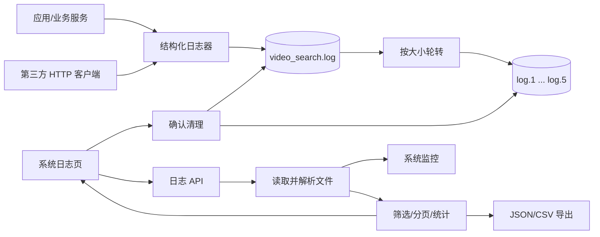

# 系统日志模块开发设计

> 本文档针对 VideoSearch 中的系统日志模块，描述结构化 JSON Lines 日志采集、轮转、查询筛选、分页、导出和清理的实现边界。

---

## 1. 需求

### 1.1 模块目标

系统日志模块为本机运行提供可追溯事实：记录应用事件和第三方资源站请求的开始、成功、失败、超时及耗时，并在界面中支持筛选、分页、详情查看、JSON/CSV 导出和经确认后的清理。日志是系统监控模块的唯一原始数据来源之一，日志模块不负责从日志推导业务指标。

### 1.2 已确认事实

- 日志配置和格式化在 `backend/app/core/logging.py`；使用 JSON Lines 文件和 `RotatingFileHandler`。
- 主日志路径由 `settings.LOG_FILE_PATH` 计算，默认位于应用数据目录 `logs/video_search.log`；默认最大 10 MB、保留 5 个轮转备份。
- `JsonLineFormatter` 输出 `id/time/timestamp/level/message/logger_name/log_type`，并按记录属性附加站点、状态、请求 ID、耗时、数据量、URL、错误和异常等字段。
- `RequestLogger` 由 `backend/app/utils/http_client.py` 调用，记录请求开始、成功、错误和超时；日志类型通过 logger 名称或操作属性判定为 `request/system/operation`。
- 查询、统计、导出和清理服务在 `backend/app/services/logs.py`；API 入口在 `backend/app/api/v1/logs.py`；前端页面是 `frontend/src/views/admin/SystemLogs.vue`。
- 查询服务读取当前日志和轮转文件，无法解析的单行会跳过；关键词筛选基于原始行小写文本。
- 当前日志查询、统计、导出和清理均使用 POST；文件导出直接返回附件，不包普通 `ApiResponse`。

### 1.3 功能需求

1. 统一记录系统和第三方请求事件，提供稳定的时间、级别、类型和关联字段。
2. 自动按文件大小轮转，保留配置数量的备份文件。
3. 按日志类型、级别、开始/结束时间和关键词组合筛选，按时间倒序分页。
4. 查看日志统计，包括总量、级别、类型、近期错误和最新时间。
5. 查看单条日志详情，支持复制完整 JSON；当前列表响应直接包含详情字段，前端通过弹窗展示。
6. 按当前筛选条件导出 JSON 或 CSV，下载文件名和媒体类型正确。
7. 经二次确认清理当前日志和可选轮转备份，返回清理条数和结果。
8. 单行损坏、备份缺失或某个文件读取异常时，按错误边界处理，不把原始堆栈返回用户。

### 1.4 非功能需求

- **安全/隐私**：不得记录密码、Token、Cookie、密钥或无必要的完整敏感请求内容；第三方 URL 和关键词应仅保留监控/排障需要的字段。
- **可靠性**：日志系统故障不能导致核心搜索业务崩溃；查询时跳过无法解析的行并保留其他合法记录。
- **性能**：当前实现按需扫描当前文件和备份文件，并在内存中筛选/排序；日志量超过本地单机可接受范围时应评估索引化或分页读取，而不是无限扩大内存。
- **一致性**：列表、统计和导出应使用相同的文件集合、解析规则和筛选口径；清理后监控缓存可能短暂保留旧指标，需在监控模块刷新/失效。
- **可用性**：前端区分首次加载、刷新、空结果、导出中和清理中，清理按钮必须有明确不可恢复提示。

### 1.5 范围与职责边界

**本模块负责**：日志格式、文件轮转配置、读取解析、筛选分页、统计、导出和清理。

**本模块不负责**：远程日志上传、集中检索、告警通知、监控指标口径、资源站连接测试规则和数据库审计。第三方请求日志由 HTTP 支撑产生，系统监控只读取本模块公开的日志记录。

**设计假设**：日志文件只由当前本地后端写入，应用退出时不需要跨进程并发清理；如果未来多个进程共享日志文件，需要改用进程安全的采集/聚合方式。

### 1.6 验收标准

- 应用启动后在用户数据目录创建日志文件和轮转配置；请求日志包含站点、状态、耗时和错误类别。
- 查询按类型、级别、时间和关键词组合筛选，坏行不阻断其他记录，分页总数和排序正确。
- 统计结果与查询读取的日志集合一致；JSON/CSV 导出内容与筛选条件一致，附件响应可下载。
- 清理前必须二次确认；可分别控制是否删除轮转备份，清理失败不返回成功。
- 日志中不出现敏感配置、Token、Cookie、SQL、堆栈泄露到用户响应或不必要的完整第三方内容。

## 2. 该项目的模块结构与流程

### 2.1 模块关系

- **产生日志的上游**：后端启动/异常、资源站管理、视频搜索和共享 HTTP 客户端；`RequestLogger` 记录资源站请求。
- **本模块内部**：标准 `logging` → `JsonLineFormatter`/轮转 Handler → 日志文件；日志 API → 日志服务 → 文件解析/筛选/导出。
- **下游**：系统监控读取结构化日志生成趋势、健康和站点性能；用户通过系统日志页面排障和导出。
- **运行支撑**：Electron 提供应用数据目录，日志模块不直接依赖 Electron IPC。

### 2.2 当前代码边界

| 边界 | 当前实现 | 责任 |
|---|---|---|
| 日志初始化 | `backend/app/main.py`、`core/logging.py` | 应用启动配置 Handler 和文件路径 |
| 格式化/轮转 | `backend/app/core/logging.py` | JSON Lines 字段、日志类型和轮转 |
| 请求采集 | `backend/app/utils/http_client.py`、`RequestLogger` | 第三方请求开始/结束/失败事实 |
| 查询服务 | `backend/app/services/logs.py` | 读取、解析、筛选、统计、导出、清理 |
| API | `backend/app/api/v1/logs.py` | 普通响应与文件下载边界 |
| 前端页面 | `frontend/src/views/admin/SystemLogs.vue` | 筛选、分页、详情、复制、下载、确认 |

### 2.3 核心流程

1. 应用启动创建用户日志目录，配置根 Logger、JSON Lines Formatter 和轮转 Handler。
2. 第三方请求开始时写入请求 ID/URL，结束时追加状态、耗时、数据量；失败和超时写入错误字段。
3. 日志文件达到大小上限后由 Handler 生成轮转备份。
4. 日志页提交筛选条件，服务读取当前文件和备份，逐行解析并忽略非法行，再按时间倒序过滤和分页。
5. 统计/监控复用同样的读取规则；导出复用筛选结果生成 JSON 或 CSV 文件响应。
6. 用户确认清理后清空当前文件并按选项删除备份；监控下一次读取时反映日志历史已消失。

### 2.4 状态、异常、并发和清理规则

- 日志查询是无状态短请求；不在数据库保存查询结果，也不建立持久任务。
- 文件在轮转/写入期间可能被读取；解析失败跳过单行，文件级 `OSError` 转换为日志读取失败。**设计建议**：导出/清理时对文件集合做快照或使用短时锁，避免边读边轮转导致结果不一致。
- 清理属于不可恢复操作；当前 API 可以指定 `include_backups`，前端应始终显示影响范围并等待完成后刷新统计和列表。
- 清理和监控缓存存在短暂一致性窗口；成功清理后应使 `monitor` 的进程内缓存失效或等待 TTL（当前为 30 秒）自然过期。

### 2.5 关键技术选择与实施顺序

继续使用 JSON Lines 文件而不是新增日志数据库，原因是本项目为本地单机工具、日志需要导出原始记录且已有轮转 Handler。API 方法和 Request Schema 已统一为 POST JSON Body；后续重点是固定字段和敏感字段白名单，统一查询/导出口径，随后处理清理锁和监控缓存失效，最后验证轮转、坏行和下载响应。

## 3. 数据库的设计

### 3.1 持久化结论

系统日志模块**不使用 SQLite 表**。原始日志由本地文件系统持久化，路径由 `settings.LOG_FILE_PATH` 管理；系统监控从这些文件读取派生数据，不能把监控结果当作日志事实写回数据库。

### 3.2 文件实体与结构

| 文件 | 作用 | 生命周期 |
|---|---|---|
| `logs/video_search.log` | 当前 JSON Lines 日志 | 持续追加，达到 `LOG_MAX_BYTES` 后轮转 |
| `logs/video_search.log.1` 至 `.5` | 轮转备份 | 由 `LOG_BACKUP_COUNT` 限制，旧备份被 Handler 淘汰 |
| 导出文件 | 用户按筛选条件生成的 JSON/CSV 下载 | 由前端下载，后端不长期保存 |

每行是一个 JSON 对象，核心字段为：

- `id`、`time`、`timestamp`：记录标识和排序时间；
- `level`、`message`、`logger_name`、`log_type`：日志分类；
- 可选 `request_id`、`site`、`url`、`status`、`elapsed_ms`、`data_count`、`error`、`exception` 及操作上下文。

当前没有文件索引、全文索引、保留天数、远程备份或脱敏存档。若未来日志规模需要数据库化，应另行设计迁移和保留策略，不在本模块隐式增加表。

### 3.3 读取、导出和隐私边界

查询、统计和导出必须读取同一组当前/备份文件，并使用同一行解析、时间转换和关键词匹配规则。无法解析的行跳过但不删除原始文件；清理才会删除内容。导出 JSON 保留结构化字段，CSV 使用核心字段和 `extra` JSON 列，不能把异常堆栈自动扩散到其他日志或响应。

日志可能包含站点地址和搜索关键词，这些属于本地敏感运行数据。日志格式化器应采用明确字段白名单，禁止将环境变量、认证头、Cookie、完整请求体和数据库错误 SQL 写入文件。用户导出文件由前端下载，不由服务端写入任意用户路径。

### 3.4 并发、备份和删除

标准 Handler 负责进程内轮转；查询读取时应容忍当前文件在轮转后消失或备份数量变化。清理操作只允许在设置的日志目录内进行，备份路径由后端固定生成，不能接受用户任意路径。清理失败要尽量保持当前/备份文件原状，不自动执行数据库或其他应用数据清理。

## 4. API 接口的设计

### 4.1 现行统一契约

当前 `logs.py` 的列表、统计、导出和清理路由均使用 POST + Request Schema；文件导出直接返回 `Response`。普通接口统一使用 `ApiResponse`，文件下载保留附件响应，因为它不是普通业务 Envelope。

### 4.2 现行接口

以下为当前后端和前端已经采用的接口契约；筛选条件和导出格式均通过 JSON Body 传递。

| 接口 | 方法 | 请求 | 成功响应 |
|---|---|---|---|
| `/api/v1/logs/system/list` | POST | `LogListRequest`：分页、类型、级别、时间、关键词 | `ApiResponse[PaginatedResponse[LogItemResponse]]` |
| `/api/v1/logs/stats` | POST | `LogStatsRequest`（明确空请求模型） | `ApiResponse[LogStatsResponse]` |
| `/api/v1/logs/export` | POST | `LogExportRequest`：筛选条件 + `export_format` | `Response` 附件，`application/json` 或 `text/csv` |
| `/api/v1/logs/clear` | POST | `ClearLogsRequest.include_backups` | `ApiResponse[ClearLogsResponse]` |

列表响应必须保留 `lists` 和 `pagination`；日志详情当前随 `LogItemResponse` 返回，不新增独立详情接口。若以后单条详情需要，应新增 POST + 明确 `log_id` Request Schema。

### 4.3 调用方向、错误和安全

调用方向是 `SystemLogs.vue` → `api/logs.js` → 本地日志 API → 日志文件。当前无登录权限，接口只应通过本地回环服务访问；如果未来开放远程访问，导出和清理必须设置更高权限并在服务端授权。

- 参数错误：分页越界、时间格式不合法、导出格式不是 JSON/CSV。
- 基础设施错误：日志目录不可读、写入/清理失败、文件编码或系统权限异常。
- 解析降级：单行 JSON 损坏不作为整个列表失败；文件不存在可按空日志处理，但需明确与读取异常区分。
- 清理/导出不得把本地绝对路径、内部异常、密钥或完整堆栈作为公开错误消息。
- 导出是读取操作但可能生成大响应；当前无异步任务，后续若日志规模超过内存上限再设计流式/后台任务，不在本次文档中伪造任务状态。

### 4.4 前端调用边界与验收

`frontend/src/api/logs.js` 负责 POST Body、文件下载的 `responseType: blob` 和统一请求入口；`SystemLogs.vue` 负责筛选表单、分页、详情弹窗、剪贴板、导出文件名解析和 `AppConfirm` 清理确认。取消/刷新不应重复显示错误 Toast，清理成功后必须刷新列表和统计。

验收覆盖正常日志、空日志、坏行、轮转备份、组合筛选、分页、JSON/CSV 下载、清理当前文件/备份、权限失败、导出大结果和敏感字段检查。
