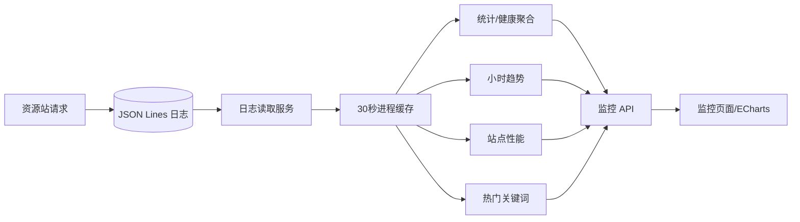

# 系统监控模块开发设计

> 本文档针对 VideoSearch 中的系统监控模块，描述基于本地结构化日志的搜索统计、趋势、站点性能、热门关键词和健康概览设计。

---

## 1. 需求

### 1.1 模块目标

系统监控模块把系统日志中的请求事实转换成用户可读的本地运行指标，帮助判断搜索请求是否完成、哪个资源站响应较慢、错误集中在哪个时间段。它只反映本机后端已经记录的请求，不代表第三方资源站的官方可用性，也不直接发起探测请求。

### 1.2 已确认事实

- 页面入口是 `frontend/src/views/admin/SystemMonitor.vue`；使用 ECharts 展示每小时趋势和热门关键词，支持时间窗口选择、手动刷新和 30 秒自动刷新暂停/恢复。
- API 入口是 `backend/app/api/v1/monitor.py`，Schema 在 `backend/app/schemas/monitor.py`，聚合逻辑在 `backend/app/services/monitor.py`。
- 监控服务从 `services/logs.py` 读取当前日志和轮转备份，只统计 `log_type=request` 且具有耗时、状态或错误字段的已完成请求。
- 监控缓存为进程内 `_entries_cache`，TTL 30 秒，按 `hours_back` 保存读取结果；趋势按完整日期小时构造桶，前端只显示简短 label。
- 成功率以请求日志为分母；错误/警告级别、请求错误字段或非 2xx 状态被判定为失败；平均响应时间只统计大于 0 的耗时。
- 当前监控查询接口和前端 API 已统一使用 POST + Request Schema JSON Body；窗口参数由请求模型校验。
- 系统监控不使用 SQLite，不存储独立指标快照；日志被清理后历史指标会消失，缓存过期前可能短暂显示旧结果。

### 1.3 功能需求

1. 展示仪表板概览：请求/搜索次数、成功率、平均响应时间和错误数。
2. 在 1–168 小时范围内查看搜索统计、成功/失败数量和平均耗时。
3. 展示系统健康状态、错误数、警告数、平均响应和最新日志时间。
4. 展示近一小时实时摘要，包括运行状态、最近请求和错误数量。
5. 按站点汇总请求数、成功数、失败数、成功率和平均响应时间，并按请求数排序。
6. 按完整日期小时展示趋势，缺少请求的时间桶也要保留为 0，避免图表断轴。
7. 按 URL 查询参数提取热门搜索关键词并按次数排序，支持限制返回数量。
8. 支持窗口切换、手动刷新和可暂停/恢复的定时刷新，页面离开时释放图表和定时器。

### 1.4 非功能需求

- **口径可解释**：每项指标必须能追溯到日志字段和明确过滤规则；一次用户跨站搜索会贡献多个站点请求，不能称为独立用户搜索数。
- **性能**：同一窗口内尽量复用一次日志读取结果，30 秒缓存避免每个指标重复扫描文件；前端并行加载指标，但不能因一个图表初始化失败泄露资源。
- **可靠性**：日志不存在/为空返回零值；单行损坏由日志服务跳过；日志读取异常返回统一错误并保留页面已有数据。
- **隐私**：热门关键词来自本地日志 URL，展示前不应输出无关查询参数、Token 或敏感 URL；日志字段脱敏由系统日志/请求采集边界负责。
- **可用性**：错误、首次加载、空趋势、自动刷新和窗口变化都有清晰反馈；图表必须有文本/表格等可理解的基础数据或空态。

### 1.5 范围与职责边界

**本模块负责**：读取日志、定义指标口径、时间窗口、内存缓存、健康状态和前端图表/摘要展示。

**本模块不负责**：产生原始日志、第三方主动探测、远程监控、告警通知、日志清理、资源站配置、搜索业务排序和播放器监控。系统日志模块负责原始事实，资源站测试模块负责连接测试。

**设计假设**：监控规模为本地日志文件和最多数百个站点请求/时间窗口；如果日志量增长到扫描文件明显阻塞界面，应另行设计索引或离线聚合，不在当前服务中无界增加缓存。

### 1.6 验收标准

- 选择 6/24/72 小时或其他合法窗口后，所有指标使用同一窗口并返回完整时间桶。
- 无日志时页面显示零值和空态，不报错；日志清理后监控在缓存失效/刷新后反映新状态。
- 站点成功率、失败数和平均耗时与请求日志字段一致；完整日期小时跨日、跨月、跨年不碰撞。
- 手动刷新和 30 秒自动刷新不会创建重复定时器；暂停后不再请求，恢复后只保留一个定时器。
- 页面卸载释放 ECharts 实例、resize 监听和定时器；网络失败保留已有数据显示并提供重试。

## 2. 该项目的模块结构与流程

### 2.1 模块关系

- **上游**：`core/logging.py` 和 `RequestLogger` 产生结构化日志；HTTP 客户端记录站点请求状态、耗时和数据量。
- **本模块内部**：监控 API → `services/monitor.py` → `services/logs.py` → 日志文件；前端 API 并行请求各指标，页面把数据交给 ECharts 和表格。
- **协作模块**：系统日志页面提供原始记录定位；资源站管理和视频搜索共同产生站点请求；Electron 只提供运行承载。
- **依赖方向**：监控只能读取日志服务公开函数，不直接访问日志文件路径之外的业务数据，也不发起外部资源站请求。

### 2.2 当前代码边界

| 边界 | 当前实现 | 责任 |
|---|---|---|
| 前端页面 | `frontend/src/views/admin/SystemMonitor.vue` | 窗口选择、刷新、摘要、表格、ECharts 和生命周期 |
| 前端 API | `frontend/src/api/monitor.js` | 各指标端点和时间窗口参数 |
| 后端 Router | `backend/app/api/v1/monitor.py` | 参数约束、统一响应 |
| Schema | `backend/app/schemas/monitor.py` | 概览、统计、健康、趋势、站点和关键词结构 |
| 聚合服务 | `backend/app/services/monitor.py` | 日志筛选、缓存、时间桶和统计口径 |
| 原始日志 | `backend/app/services/logs.py` | 文件读取、解析和时间窗口过滤 |

### 2.3 核心流程

1. 用户进入监控页，页面并行请求概览、搜索统计、健康、实时、站点性能、趋势和热门关键词。
2. 每个指标按窗口调用监控 Service；Service 先从按窗口缓存读取日志，未命中则让日志服务读取当前文件和轮转备份。
3. 监控筛选已完成请求，按成功判定规则计算计数、百分比和平均耗时；趋势先构造从当前小时向前的完整桶，再填充请求数据。
4. 关键词从请求 URL 的 `wd/keyword/searchword/q` 查询参数中提取，按原始关键词计数并限制返回数量。
5. 前端将摘要渲染为卡片/表格，趋势和关键词分别初始化 ECharts；刷新时更新数据，窗口变化时重新请求。
6. 页面卸载释放图表实例、窗口监听和自动刷新定时器；日志清理由系统日志页面执行，不由监控页面触发。

### 2.4 指标口径、异常和缓存

- `_get_completed_requests()` 只统计 `log_type=request` 且存在完成依据的日志；请求开始日志不计入完成数。
- `_is_success_request()`：有错误字段或 ERROR/WARNING 级别为失败；有状态码时仅 200–399 成功；无状态码且无错误视为成功。
- 平均响应时间排除 0 和缺失耗时；成功率无分母时返回 0。
- 健康状态默认 `healthy`，存在错误为 `warning`，错误数达到 10 为 `error`；这是本地展示阈值，不是第三方可用性结论。
- 监控缓存是可丢失优化，按小时窗口隔离；日志清理成功后应清空相关缓存，至少不能把旧缓存描述为当前事实。
- API 失败时页面保留上一次成功数据，错误区域提供重试；单个 ECharts 更新失败不能阻止其他卡片和表格展示。

### 2.5 关键技术选择与实施顺序

采用“日志文件 + 进程内短缓存 + 请求时聚合”，不新建指标数据库或后台采集任务，匹配当前本地单机规模和日志可导出要求。API 已统一使用 POST + Request Schema；后续重点是补齐清理后的缓存失效和前端生命周期，最后验证跨日期桶、空数据、定时刷新和错误保留旧值。

## 3. 数据库的设计

### 3.1 持久化结论

系统监控模块**不直接持久化数据，也不创建 SQLite 表**。原始事实由系统日志模块的 JSON Lines 文件保存，监控结果在请求期间从日志计算并放入进程内缓存；进程退出、缓存过期或日志清理后，派生指标可重建或消失。

### 3.2 数据来源与缓存结构

| 数据 | 来源/结构 | 生命周期 |
|---|---|---|
| 请求事实 | `video_search.log` 及轮转备份中的 `log_type=request` 记录 | 由日志轮转/清理策略控制 |
| 指标结果 | `services/monitor.py` 按窗口聚合的响应 Schema | 仅随 API 返回，不落盘 |
| `_entries_cache` | `{hours_back: (cached_at, entries)}` | TTL 30 秒，进程内，非共享 |
| 前端数据 | Vue 组件 refs；ECharts 实例为内存对象 | 页面生命周期内，离开释放 |

不为每个指标新增表、快照或版本字段；如果未来需要跨重启趋势，应另行定义归档、保留和数据校正策略，不能把当前缓存误认为历史库。

### 3.3 时间、索引和一致性

日志服务按毫秒时间戳读取，并按窗口过滤；趋势桶键使用完整 `YYYY-MM-DD HH:00`，展示 label 可缩短为 `MM-DD HH:00`。站点性能按 `site` 分组，热门关键词只解析 URL 中约定的查询参数。

同一页面刷新应尽量复用相同窗口的缓存，避免七个指标重复扫描文件；缓存不是事务，读取期间日志轮转可能造成边界差异，页面只需保证单次响应内部自洽。日志清理后监控缓存必须失效或在 30 秒内过期，不能主动恢复被清理的历史。

### 3.4 隐私、删除和备份

监控不复制关键词或 URL 到新的持久存储；展示热门关键词属于本地用户可见数据，清理责任由系统日志模块承担。导出监控指标当前不在范围内；若增加导出，应明确脱敏和时间窗口，不直接导出所有原始 URL。

由于没有数据库结构，数据库备份/迁移不适用；日志备份和清理由系统日志模块负责。任何未来将指标落盘的变化都需要重新设计数据保留、删除、脱敏和授权边界。

## 4. API 接口的设计

### 4.1 现行契约

当前 `backend/app/api/v1/monitor.py` 和前端 `api/monitor.js` 已统一使用 POST；旧 GET Query 参数契约不保留。每个查询接口使用明确 Request Schema，时间窗口通过 JSON Body 传递，成功响应统一 `ApiResponse[T]`，API 层使用 `success()`/`error()`。

### 4.2 现行接口

以下为当前后端和前端已经采用的接口契约；时间窗口和数量限制均通过 JSON Body 传递。

| 接口 | 方法 | Request Schema | 成功响应 |
|---|---|---|---|
| `/api/v1/monitor/dashboard` | POST | `DashboardRequest`（明确空请求模型） | `ApiResponse[DashboardOverviewResponse]` |
| `/api/v1/monitor/search-stats` | POST | `MonitorWindowRequest.hours`（1–168） | `ApiResponse[SearchStatsResponse]` |
| `/api/v1/monitor/system-health` | POST | `MonitorWindowRequest.hours` | `ApiResponse[SystemHealthResponse]` |
| `/api/v1/monitor/real-time` | POST | `RealTimeRequest`（明确空请求模型） | `ApiResponse[RealTimeSummaryResponse]` |
| `/api/v1/monitor/site-performance` | POST | `MonitorWindowRequest.hours` | `ApiResponse[SitePerformanceResponse]` |
| `/api/v1/monitor/trends` | POST | `MonitorWindowRequest.hours` | `ApiResponse[TrendsResponse]` |
| `/api/v1/monitor/hot-keywords` | POST | `HotKeywordsRequest.hours/limit` | `ApiResponse[HotKeywordsResponse]` |

`lists` 仅用于站点性能、趋势和热门关键词的列表字段；不另造分页结构，因为这些接口返回固定窗口聚合而非数据库列表。每个响应必须明确窗口和统计单位，避免前端自行重新计算口径。

### 4.3 调用方向、错误和并发

调用方向是 `SystemMonitor.vue` → `api/monitor.js` → 监控 API → 日志读取服务。当前无认证，接口只能暴露给本地桌面/前端；未来远程访问需要服务端权限，不能依赖“admin”页面目录名。

- 参数错误：小时数不在 1–168、热门关键词 limit 不在 1–50。
- 日志读取/权限错误：返回统一内部错误，不泄露文件路径。
- 空数据：成功返回零值、空列表和 `healthy` 默认状态，不用错误响应表示“没有日志”。
- 并发刷新：前端应避免同一窗口重复请求；自动刷新和手动刷新重叠时只接受最新结果或保留已加载数据。
- 取消/卸载：页面离开后不应继续更新图表或组件状态；若请求层支持 AbortSignal，应取消未完成的批量指标请求。

### 4.4 前端调用边界与验收

`frontend/src/api/monitor.js` 只负责 POST Body 和统一请求入口；`SystemMonitor.vue` 负责加载状态、旧数据显示、图表配置、resize 和定时器；ECharts 只消费后端已聚合的列表，不重复计算成功率或时间桶。

验收覆盖合法/非法时间窗口、无日志、日志坏行、站点请求成功/失败、跨日期趋势、热门关键词提取、缓存命中/过期、清理后刷新、网络失败保留旧数据、暂停/恢复自动刷新和页面卸载资源释放。
