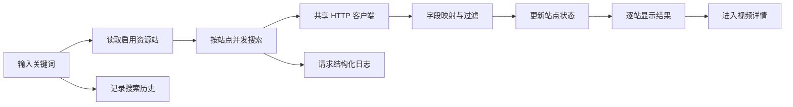

# 视频聚合搜索模块开发设计

> 本文档针对 VideoSearch 中的视频聚合搜索模块，描述多资源站并发检索、站点级状态、结果适配、分页、失败重试和三天结果缓存的实现边界。

---

## 1. 需求

### 1.1 模块目标

视频聚合搜索模块把一次关键词搜索拆成多个相互独立的资源站任务，让用户在同一页面看到各站点的搜索进度、结果和失败原因。模块不把不同站点强行合并排序，而是保持站点维度，方便用户判断来源和单独重试。

### 1.2 已确认事实

- 前端入口是 `frontend/src/views/user/Home.vue`；`frontend/src/stores/search.js` 编排跨站请求、取消、状态和三天本地缓存；`frontend/src/api/videos.js` 封装单站搜索和详情请求。
- 后端入口是 `backend/app/api/v1/videos.py`，服务是 `backend/app/services/videos.py`，异构响应由 `backend/app/utils/video_mapper.py` 适配，通用 HTTP 与请求日志由 `backend/app/utils/http_client.py` 提供。
- 搜索前从资源站管理模块读取启用站点；后端再次调用 `validate_enabled_site()`，不能信任前端站点状态。
- 后端缓存键为 `(site_id, normalized_keyword, page, page_size)`，默认 TTL 为 3 天，最多 128 条；TTL 和容量可通过 `SEARCH_CACHE_TTL_SECONDS`、`SEARCH_CACHE_MAX_ENTRIES` 配置。前端缓存键为 `videosearch.search.state`，版本为 3，按站点分页保存结果条目，默认 TTL 为 3 天，最多保留 32 条。
- 后端会过滤 `预告片`、`电影解说`、`影视解说`，并返回原始数量、过滤数量、展示数量和第三方总数。
- 当前项目 API 已统一使用 POST JSON Body；前端继续用 `AbortController` 取消旧的跨站搜索，后端向第三方资源站发起的请求仍遵循资源站自身的 GET 契约。

### 1.3 功能需求

1. 校验非空关键词，在用户发起搜索时记录搜索历史；历史写入失败不能阻断主搜索。
2. 获取全部启用站点，为每个站点启动独立搜索请求，并按完成顺序逐步更新页面。
3. 每个站点独立维护 `loading/success/failed` 状态、结果、分页和错误信息。
4. 单站超时、结构错误、反爬响应或无结果不能阻断其他站点。
5. 用户可点击失败站点重新搜索，已成功站点的结果保留。
6. 当前站点可单独翻页，其他站点结果不被清除。
7. 将第三方响应映射为统一视频字段和按线路组织的播放源，并过滤明确不展示的类型。
8. 新搜索取消旧请求，旧请求即使晚到也不能覆盖当前关键词结果。
9. 恢复最近搜索界面并复用已缓存的站点分页结果，缓存默认保留 3 天；过期、版本变化或损坏时自动丢弃并重新搜索。

### 1.4 非功能需求

- **失败隔离**：每个站点请求使用独立 Promise 和状态槽位，错误响应只归属自己的 `site_id`。
- **并发与取消**：前端使用一个当前 `AbortController` 和递增序列号；后端共享异步客户端复用连接池，但不在服务端启动持久任务。
- **外部依赖保护**：每个站点使用其配置的超时；不对非幂等操作自动重试，搜索重试由用户显式触发。
- **数据安全**：关键词会发送给启用的第三方站点，并按三天期限存入浏览器本地缓存；请求日志不应记录超出排障所需的敏感参数。
- **性能**：前端逐站渲染，不等待所有站点完成后才展示；后端映射和过滤在单站请求内完成，缓存只作为可丢失优化。

### 1.5 范围与职责边界

**本模块负责**：搜索关键词校验、站点任务编排、站点级结果状态、分页、失败重试、字段适配入口、过滤统计和三天结果缓存。

**本模块不负责**：资源站配置的增删改、跨站去重/排序、内容审核、视频详情之外的元数据更新、播放器实例、收藏和观看进度。详情模块只消费本模块产生的搜索上下文；个人数据模块负责历史持久化。

**设计假设**：当前搜索规模是十到几十个站点，客户端直接并发请求可接受；如果站点数量大幅增加，应改为有限客户端并发或后端聚合任务，而不是无界创建浏览器请求。

### 1.6 验收标准

- 输入关键词后，启用站点按完成顺序出现状态和结果，单站失败不影响其他站点。
- 新关键词搜索会取消旧请求；旧响应不会修改当前 `keyword/resultMap/statusMap`。
- 失败站点可单独重试，成功站点结果和当前选中站点不被清空。
- 分页请求只刷新当前站点，返回的分页字段与第三方总数不一致时页面仍能显示空结果和可用分页。
- 过滤统计和统一字段正确；缺失字段使用安全默认值，播放源按线路保留剧集关系。
- 缓存损坏、写满或过期不会阻断搜索；后端缓存达到上限时淘汰最旧条目。

## 2. 该项目的模块结构与流程

### 2.1 模块关系

- **上游**：资源站管理提供用户配置和启用站点；搜索首页接收用户关键词和分页操作。
- **本模块内部**：`Home.vue` → `search` Store → `api/videos.js` → 视频 API → `services/videos.py` → 资源服务、HTTP 客户端和视频映射器。
- **下游**：搜索结果进入视频详情；关键词写入搜索历史；每次第三方请求写入系统日志并被系统监控聚合。
- **依赖方向**：搜索可以调用资源服务的公开校验函数，但 HTTP 客户端和映射器不反向依赖前端或搜索 Store。

### 2.2 当前代码边界

| 边界 | 当前实现 | 责任 |
|---|---|---|
| 页面 | `frontend/src/views/user/Home.vue` | 搜索表单、站点标签、结果卡片、空态、历史和继续观看入口 |
| 状态 | `frontend/src/stores/search.js` | 并发请求、队列式逐站更新、取消竞态、缓存和重试 |
| API | `frontend/src/api/videos.js` | 参数命名转换、AbortSignal 传递和统一请求入口 |
| 后端 API | `backend/app/api/v1/videos.py` | 参数模型、响应模型和 ServiceException 转换 |
| 搜索服务 | `backend/app/services/videos.py` | 启用站点校验、第三方调用、过滤、分页和缓存 |
| 适配器 | `backend/app/utils/video_mapper.py` | 响应包裹兼容、字段清洗、播放源解析 |
| 传输/日志 | `backend/app/utils/http_client.py` | 共享 `AsyncClient`、超时、JSON 解析和请求日志 |

### 2.3 核心流程

1. 用户提交关键词，Store 取消上一次搜索并生成新的 `searchSeq`。
2. Store 确保资源站列表已加载，只取启用站点；无启用站点时直接给出可恢复错误。
3. 每站调用 `/videos/search`，完成事件进入前端队列；队列保证页面可逐站刷新。
4. 后端校验站点仍启用，构造站点定义的查询参数，发起第三方 GET 请求。
5. HTTP 结果交给映射器提取视频列表和总数，过滤指定类型，构造 `VideoSearchResponse` 并写入后端缓存。
6. 前端收到结果后写入 `resultMap[site_id]`，失败写入 `failureMap[site_id]`，并设置当前站点。
7. 用户切换分页或重试时只操作指定站点；点击结果后将 `site_id/vod_id/keyword/page` 带到详情路由。

### 2.4 状态、异常和并发

- 站点状态是 `loading`、`success`、`failed`；结果、失败原因和状态必须使用同一 `site_id` 作为关联键。
- 取消异常不显示为系统故障；网络、超时、第三方错误和映射失败转换为站点级失败信息。
- `searchSeq` 是最终写入资格，旧搜索即使 Promise 完成也不能更新当前状态；`AbortController` 用于尽快释放网络资源。
- 后端缓存是进程内字典，不跨进程、不作为永久事实；详情缓存未命中时重新搜索对应页。
- 当前搜索写历史使用 fire-and-forget Promise；**设计建议**：保留“历史失败不阻塞搜索”的策略，同时捕获取消和网络错误，不向控制台输出敏感请求数据。

### 2.5 关键技术选择与实施顺序

- 采用前端站点级 fan-out，而不是新建后端聚合长任务，原因是当前 UI 需要按完成顺序反馈，且后端已经提供单站搜索接口。
- 继续在 `video_mapper.py` 消化资源站差异，搜索服务只消费统一字段，避免页面复制第三方字段判断。
- API 方法和 Request Schema 已统一为 POST JSON Body；后续实施重点是固定 DTO/映射和错误语义，处理取消与分页竞态，最后核验两级缓存的失效和恢复。

## 3. 数据库的设计

### 3.1 持久化结论

本模块不直接写 SQLite。后端搜索结果只进入进程内 `_search_cache`，前端搜索界面状态进入浏览器 `localStorage`；搜索关键词的长期记录由个人数据模块的 `search_history` 表负责。

### 3.2 缓存结构与生命周期

| 缓存位置 | 键 | 值 | 生命周期/失效 |
|---|---|---|---|
| 后端 `services/videos.py` | `(site_id, normalized_keyword, page, page_size)` | `VideoSearchResponse` 与写入时间 | 默认 3 天；最多 128 条，超限淘汰最旧项；进程退出丢失；读取或写入时惰性清除过期项 |
| 前端 `stores/search.js` | `videosearch.search.state` | 版本、按站点分页的结果条目、最近界面状态和保存时间 | 默认 3 天；最多 32 条结果条目；版本不匹配、过期、JSON 损坏或写入异常时清理 |

缓存不是数据库事务的一部分，也不保证跨窗口一致。站点配置变更、第三方内容变更或响应结构升级时，应通过缓存版本/键变化显式失效；缓存失败只能降低体验，不能改变搜索正确性。

### 3.3 数据流、隐私与删除

- 关键词在请求阶段进入第三方 URL 参数，用户应知晓启用站点会接收该关键词。
- 浏览器缓存保存最近站点分页结果，重复搜索或切换已缓存页时优先恢复；清空搜索结果或过期后删除；不提供独立导出接口。
- 后端缓存不提供删除 API，随 TTL、容量淘汰或进程退出清理；本次默认保留 3 天，以减少重复访问第三方资源站。
- 搜索历史的删除、清空和数据库隐私责任属于个人数据模块；本模块不能绕过其事务边界直接操作表。

### 3.4 一致性和失败处理

第三方结果、后端缓存和前端缓存都属于可重建数据，不需要数据库事务。响应映射失败不得写入半结构结果；前端只在完整 `VideoSearchResponse` 通过响应模型/字段边界后更新对应站点。结构变化时按开发期规则直接更新当前 Schema/映射和缓存版本，不创建迁移或兼容链。

## 4. API 接口的设计

### 4.1 现行契约

当前 `backend/app/api/v1/videos.py` 和前端 `api/videos.js` 已使用 POST + 明确 Request Schema JSON Body；旧 GET 查询参数契约不保留，搜索请求的取消信号通过 Axios 配置传递。Service 不返回 `ApiResponse`，API 层统一使用 `success()`/`error()`。

### 4.2 现行接口

以下为当前后端和前端已经采用的接口契约；搜索参数通过 JSON Body 传递，外部资源站请求仍遵循其自身接口方法。

| 接口 | 方法 | Request Schema | 成功响应 |
|---|---|---|---|
| `/api/v1/videos/search` | POST | `VideoSearchRequest`：`wd`、`site_id`、`page`、`page_size` | `ApiResponse[VideoSearchResponse]` |
| `/api/v1/videos/detail` | POST | `VideoDetailRequest`：`keyword`、`site_id`、`vod_id`、`page` | `ApiResponse[VideoDetailResponse]` |

后端只提供单站查询接口；“多站聚合”是前端 Store 的编排行为，不另造一个同步等待所有站点的接口，也不引入 SSE。列表响应使用 `lists`、`pagination`，过滤统计使用 `filter_stats`，耗时使用 `elapsed_ms`。

### 4.3 调用方向、错误和取消

- 调用方向：`Home.vue/VideoResultCard` → `search` Store → `api/videos.js` → 本地后端 → 指定第三方资源站。
- 当前无认证；本地后端应保持回环监听。站点 URL、协议、重定向和响应大小由服务端校验。
- 参数错误包括空关键词、非法站点 ID、页码或页大小越界；业务错误包括站点不存在/禁用、视频不存在；外部错误包括超时、HTTP 状态异常、JSON 解析失败和字段缺失。
- 前端通过 `AbortSignal` 取消旧搜索；取消不转成 Toast，不自动重试。失败站点由用户操作 `retrySite()` 重新提交。
- 详情查询以搜索关键词和页码定位缓存结果；缓存未命中时服务端重新请求相同站点页，找不到 `vod_id` 返回数据不存在。

### 4.4 DTO、前端状态和验收

`api/videos.js` 负责把 `siteId/pageSize` 转为 `site_id/page_size`，不在页面创建 Axios 实例；`search.js` 管理逐站异步状态和最新请求资格；`video.js` 负责详情对象和播放线路归一化。页面使用现有加载、空、错误和重试组件。

验收包括：成功/空结果/站点失败/超时/取消/旧响应覆盖、分页切换、缓存恢复和映射缺失字段；错误响应不得把第三方原始响应、URL 中不必要的敏感参数或堆栈直接展示给用户。
