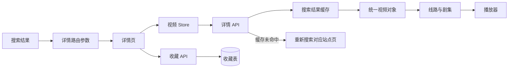

# 视频详情模块开发设计

> 本文档针对 VideoSearch 中的视频详情模块，描述搜索上下文定位、统一视频元信息、播放线路展示和收藏入口的实现边界。

---

## 1. 需求

### 1.1 模块目标

视频详情模块把搜索结果中的一个 `site_id + vod_id` 转换为用户可理解的内容详情页。它展示统一后的元信息和按线路分组的剧集入口，并把用户继续播放、收藏的动作交给对应模块处理。

### 1.2 已确认事实

- 页面入口为 `frontend/src/views/user/VideoDetail.vue`，路由为 `/video/:siteId/:vodId`；`keyword` 和 `page` 通过查询参数传入。
- 前端 `frontend/src/stores/video.js` 保存当前视频、站点信息和当前集，负责把数组或旧的对象形式播放源归一化为线路数组。
- 后端详情入口为 `backend/app/api/v1/videos.py` 的 `/videos/detail`，服务在 `backend/app/services/videos.py` 中从搜索缓存定位视频，缓存未命中时重新查询对应站点页。
- 视频字段和播放源由 `backend/app/utils/video_mapper.py` 从第三方响应中清洗；后端输出 `VideoDetailResponse`，包括站点信息和 `VideoItemResponse`。
- 收藏状态和写入由 `frontend/src/api/favorites.js` 与个人数据模块负责，详情页只提供收藏入口。
- 当前详情请求使用 POST JSON Body，详情页依赖搜索关键词才能重新定位视频；缺少关键词时主动显示错误，不猜测第三方详情接口。

### 1.3 功能需求

1. 接收站点、视频 ID、搜索关键词和页码，定位并加载对应视频。
2. 展示标题、海报、简介、类型、年份、地区、语言、评分、导演、演员、状态、总集数和更新时间。
3. 海报加载失败时使用统一占位，不影响文本信息和播放源入口。
4. 将播放源按线路分组，显示线路名称、格式和剧集数量；线路无剧集时不展示为空线路。
5. 允许用户点击任一剧集进入播放器，并把线路、剧集索引、URL 和来源上下文写入路由。
6. 在详情页查询当前收藏状态，提供添加/取消收藏按钮并反馈结果。
7. 搜索缓存过期或未命中时重新获取来源页；视频不存在、关键词缺失或外部站点失败时给出可重试错误。

### 1.4 非功能需求

- **一致性**：视频 ID 必须与站点 ID 一起使用；不能跨站复用同一个 `vod_id`。
- **降级**：字段缺失使用空字符串或占位，播放源解析失败只影响播放源区，不隐藏整页元信息。
- **并发**：路由参数变化时重新加载详情和收藏状态；旧请求不应覆盖新路由对应的视频。
- **安全**：第三方简介已由后端去除 HTML；前端不得使用未经清洗的 `v-html`。图片和播放 URL 需限制为允许的协议，并接受外部资源不可用。
- **隐私**：搜索关键词会用于后端重新查询并发送给资源站，收藏快照会在本机持久化关键词和部分视频信息。

### 1.5 范围与职责边界

**本模块负责**：详情定位、统一字段展示、播放线路/剧集入口和收藏入口状态协作。

**本模块不负责**：第三方 API 配置、异构字段解析、跨站搜索编排、播放器实例与媒体兼容、播放进度保存、收藏表事务。详情页调用播放器路由，收藏操作调用个人数据模块的公开 API。

**设计假设**：第三方资源站没有稳定、独立于搜索上下文的详情查询契约，因此继续以“关键词 + 页码 + 视频 ID”定位；如果未来站点提供详情接口，应在视频服务/适配器中扩展，不让页面直接拼接第三方字段。

### 1.6 验收标准

- 从搜索结果进入详情后，页面显示正确的站点、视频和线路；`site_id` 不发生串站。
- 缺少关键词、视频不存在、站点失败和缓存过期均有明确状态和重试入口。
- 海报、简介、元信息缺失时页面保持可读；播放源按线路显示且不把线路格式错误合并。
- 收藏状态初始加载失败不会阻断详情展示；添加/取消期间按钮防重复提交，成功后状态立即同步。
- 从每个剧集进入播放器时，路由包含能够恢复详情上下文的参数。

## 2. 该项目的模块结构与流程

### 2.1 模块关系

- **上游**：视频聚合搜索提供 `site_id/vod_id/keyword/page`；路由负责传递参数。
- **本模块内部**：`VideoDetail.vue` → `video` Store → `api/videos.js` → 视频详情 API → 搜索服务缓存/第三方映射。
- **下游**：播放线路进入播放器；收藏按钮调用收藏 API；播放记录和播放器不直接修改详情 Store 的持久数据。
- **技术依赖**：详情服务依赖资源服务验证站点、视频映射器和共享 HTTP 客户端；详情页面依赖基础加载/空/错误组件。

### 2.2 当前代码边界

| 边界 | 当前实现 | 责任 |
|---|---|---|
| 路由 | `frontend/src/router/index.js` | 提供站点 ID、视频 ID、关键词和页码 |
| 页面 | `frontend/src/views/user/VideoDetail.vue` | 元信息、收藏状态、线路和剧集导航 |
| Store | `frontend/src/stores/video.js` | 当前视频、站点信息、线路归一化和当前集 |
| 后端 API/Schema | `backend/app/api/v1/videos.py`、`schemas/videos.py` | 详情请求和响应契约 |
| 详情服务 | `backend/app/services/videos.py` | 缓存读取、必要时重新搜索、视频 ID 定位 |
| 数据适配 | `backend/app/utils/video_mapper.py` | HTML 清洗、元信息字段和播放源解析 |
| 收藏协作 | `frontend/src/api/favorites.js` | 查询状态、添加和取消收藏 |

### 2.3 核心流程

1. 搜索结果卡片构造详情路由，携带 `siteId`、`vodId`、`keyword` 和当前页码。
2. 详情页加载时清空旧 Store 数据，调用详情 API；路由参数变化时重复执行该流程。
3. 后端按 `(site_id, keyword, page)` 读取搜索缓存；没有缓存则验证启用站点并重新请求第三方。
4. 服务在当前页结果中按 `vod_id` 精确匹配，返回统一视频对象和站点名称。
5. Store 将播放源兼容转换为线路数组，页面展示线路与剧集；用户点击后生成播放器路由。
6. 收藏状态是独立请求，失败只显示非阻塞反馈；写入收藏快照后详情页更新本地按钮状态。

### 2.4 状态、异常和竞态

- 页面状态分为首次加载、成功、空播放源、错误和收藏局部加载/提交；不使用一个收藏状态覆盖详情请求状态。
- 路由变化时应绑定请求标识或取消旧请求；当前代码通过清空 Store 和 watch 重新请求，**设计建议**是让 API 支持 AbortSignal 或在 Store 中丢弃过期响应。
- 详情不存在返回业务数据不存在；关键词缺失在前端阻断请求；第三方超时/解析失败沿用搜索模块的外部服务错误。
- 播放源解析为零时展示空态，不能把整个视频当成不存在。

### 2.5 关键技术选择与实施顺序

保持“搜索结果缓存定位详情”的方案，原因是当前资源站统一提供搜索接口，且缓存已包含完整字段；详情模块不新增页面直连第三方的路径。实施时先固定 DTO 和线路结构，再处理路由参数校验、请求取消和收藏状态并行加载，最后核验图片/播放 URL 的协议与降级展示。

## 3. 数据库的设计

### 3.1 持久化结论

视频详情模块**不直接持久化数据**。详情源数据来自视频聚合搜索的进程内短期缓存或重新请求结果，前端当前视频保存在 Pinia Store，离开页面后可丢失。收藏快照由个人数据模块写入 SQLite，播放器进度由播放记录模块写入 SQLite，本模块只通过公开 API 调用。

### 3.2 数据对象与生命周期

| 数据 | 来源/存储 | 生命周期 |
|---|---|---|
| `VideoDetailResponse` | 后端搜索缓存或第三方响应 | 后端缓存默认 3 天/容量淘汰；不保证长期存在 |
| 当前视频与线路 | `useVideoStore` | 路由加载期间；离开或重新加载详情时清空 |
| 收藏状态 | 收藏 API 返回 | 以 `favorite` 表为事实源；详情页只保留当前页面状态 |
| 海报/媒体 URL | 第三方响应、路由或播放器 | 不下载、不归档；地址失效时显示/播放失败 |

### 3.3 关系、隐私和删除

详情模块不建立表、外键或索引，也不创建视频主数据表。第三方视频的 `vod_id` 只在站点范围内有意义；收藏/播放记录使用 `(site_id, vod_id)` 作为组合标识，不能由详情页单独以 `vod_id` 查询。

关键词、标题、海报、简介和播放地址可能来自第三方；当前本地收藏会保存标题、海报、类型、备注和搜索关键词。删除责任由收藏/播放记录模块承担，清除详情 Store 不会删除任何个人数据。

### 3.4 一致性与缓存失效

详情页展示的是一次搜索快照，不能承诺与第三方实时一致。缓存结构变化时由视频服务更新 Schema/Mapper 并通过缓存键或版本失效；不创建数据库迁移。缓存读取失败只触发重新查询，重新查询失败时保留错误状态而不伪造旧视频。

## 4. API 接口的设计

### 4.1 现行契约

当前详情路由为 POST `/api/v1/videos/detail`，通过 `VideoDetailRequest` JSON Body 接收 `keyword/site_id/vod_id/page`；旧 GET 查询参数契约不保留。所有普通响应使用 `ApiResponse[T]`，Service 只返回业务 DTO 或抛出业务异常。

### 4.2 详情接口

| 接口 | 方法 | Request Schema | 成功响应 |
|---|---|---|---|
| `/api/v1/videos/detail` | POST | `VideoDetailRequest`：`keyword`、`site_id`、`vod_id`、`page` | `ApiResponse[VideoDetailResponse]` |

响应包含：`site_id`、`site_name`、`video`；`video.play_sources` 是线路数组，每条线路包含 `name`、`format`、`episodes[{name,url}]`。不在 API 层返回 ORM 对象，也不把第三方原始 JSON 作为公开响应。

### 4.3 收藏和播放器调用边界

详情模块不复制收藏和播放记录接口：

- 收藏状态/写入/删除由个人数据模块提供，详情页通过统一 `api/favorites.js` 调用。
- 播放器使用详情接口得到线路和剧集，再通过播放记录模块查询/写入进度。
- 播放媒体 URL 是浏览器媒体请求，不经详情 API 代理；播放器负责资源释放和播放错误反馈。

当前无认证，服务端应绑定本地回环地址；外部 URL 和图片地址需在后端/前端边界做协议限制。参数错误、站点禁用、视频不存在、外部请求失败和内部错误分别映射为统一业务错误，不能泄露第三方响应原文。

### 4.4 前端 DTO、错误和验收

`VideoDetail.vue` 只消费 `video` Store；Store 负责响应数据归一化，API 文件负责 snake_case 参数和统一请求入口。加载、空播放源、错误、重试、收藏局部失败和图片失败分别呈现；详情路由必须能直接刷新，缺少必要参数时显示可理解错误而不是发送空请求。

验收包括：正常详情、缓存未命中重查、站点禁用、视频不存在、关键词缺失、字段缺失、播放源为空、收藏状态失败和路由快速切换场景。
