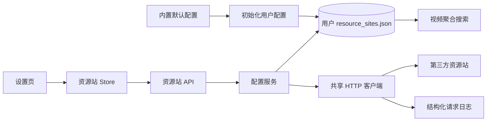

# 资源站管理模块开发设计

> 本文档针对 VideoSearch 中的资源站管理模块，描述资源站配置、启停、连通性测试、导入导出及其与搜索模块的实现边界。

---

## 1. 需求

### 1.1 模块目标

资源站管理模块解决“系统应该从哪些第三方资源站检索内容，以及这些来源当前是否可用”的配置问题。用户在本机维护资源站清单，后续视频搜索只读取其中 `enabled=true` 的站点；连接测试用于发现配置错误、超时和反爬响应，但不承诺具体视频或播放地址长期可用。

### 1.2 已确认事实

- 前端入口是 `frontend/src/views/user/Settings.vue`，跨页面状态由 `frontend/src/stores/resources.js` 管理。
- 后端业务入口是 `backend/app/api/v1/resources.py`，业务逻辑在 `backend/app/services/resources.py`，请求/响应模型在 `backend/app/schemas/resources.py`。
- 默认配置位于 `resources/resource_sites.json`，首次运行时复制到 `settings.RESOURCE_CONFIG_PATH`，即应用数据目录下的 `resource_sites.json`。
- 配置不进入 SQLite；后端通过 JSON 文件读写资源站，搜索模块通过 `validate_enabled_site()` 获取启用站点。
- 单站测试使用共享 `httpx.AsyncClient`，测试关键词和并发上限来自 `backend/app/core/config.py`；批量测试使用信号量限制并发，并以 `return_exceptions=True` 隔离单站异常。
- 后端路由和前端 API 已统一使用 POST；查询、增删改、测试和导入导出均通过 JSON Request Schema 传递参数，外部资源站请求仍按其接口契约使用 GET。

### 1.3 功能需求

1. 查看全部资源站、启用数量和禁用数量，并按站点名称在前端本地过滤。
2. 查看单个站点的完整配置，包括标识、名称、接口地址、超时时间和请求参数名。
3. 创建、编辑、删除资源站；编辑时不可修改 `site_id`。
4. 切换站点启用状态；禁用站点不得被视频搜索或批量测试使用。
5. 对单个站点执行连接测试，返回成功状态、HTTP 状态码、耗时、响应大小和失败原因。
6. 对全部启用站点执行受限并发测试，单站失败不影响其他站点，返回汇总和逐站结果。
7. 导出当前完整配置，并从包含 `sites` 数组的 JSON 配置整体覆盖当前配置。
8. 配置文件不存在时，从应用内置默认配置初始化用户可写副本。

### 1.4 非功能需求

- **安全**：后端必须校验 `base_url` 的协议、格式、重定向和可访问范围；不能因用户可编辑 URL 而无约束地形成 SSRF。日志和响应不得暴露本地密钥或完整内部堆栈。
- **可靠性**：配置读取失败、JSON 损坏、单站超时或第三方返回非 JSON 时，只影响当前操作，不使 FastAPI 进程退出。
- **并发**：批量测试的并发度受 `CONNECTION_TEST_CONCURRENCY` 控制，默认值为 5；配置写入应避免并发请求互相覆盖。
- **可恢复性**：连接测试不自动无限重试，由用户从设置页单站重试；导入覆盖前应提供明确确认和失败反馈。
- **可观察性**：连接测试通过统一 HTTP 客户端写入请求日志，包含站点、状态、耗时和错误类别，不写入不必要的敏感内容。

### 1.5 范围与职责边界

**本模块负责**：资源站配置文件生命周期、站点字段校验、启停状态、连接测试、批量测试和配置导入导出。

**本模块不负责**：第三方响应字段映射、搜索结果过滤、跨站排序、视频详情、播放地址可用性、播放器实例和观看进度。HTTP 传输由 `backend/app/utils/http_client.py` 提供，视频字段适配由 `backend/app/utils/video_mapper.py` 提供，业务搜索由视频聚合搜索模块负责。

**设计假设**：当前应用保持单机单用户、后端单实例运行；如果以后允许多个后端进程同时写同一个配置文件，需要增加文件锁或改用集中配置存储。

### 1.6 验收标准

- 首次运行可以从默认 JSON 创建用户配置，后续操作只修改用户副本。
- 站点 ID 重复、必要字段为空、超时超出 1–120 秒或配置 JSON 结构错误时，返回可理解的参数/配置错误。
- 批量测试最多同时运行配置上限数量的请求，任一站点异常时仍能返回其他站点结果。
- 禁用站点不会出现在搜索模块的启用站点集合中。
- 导入成功后列表和统计立即反映完整覆盖结果；导入失败不会留下半份配置。
- 配置读写异常、外部站点超时和反爬页面均不会导致本地后端退出。

## 2. 该项目的模块结构与流程

### 2.1 模块关系

- **上游**：`Settings.vue` 和 `resources` Pinia Store 发起配置查询、写入和测试操作；Electron 只负责提供可写应用数据目录。
- **本模块内部**：`resources.py` API → `services/resources.py` → `resource_sites.json`；连接测试另外调用共享 HTTP 客户端和结构化日志。
- **下游**：视频聚合搜索调用 `validate_enabled_site()`；系统日志记录测试请求；系统监控从请求日志统计站点表现。
- **不应反向依赖**：HTTP 基础设施不依赖资源站业务；播放器和视频详情不直接读取配置文件。

### 2.2 当前代码边界

| 边界 | 当前实现 | 设计职责 |
|---|---|---|
| 配置入口 | `backend/app/core/config.py` | 计算默认配置、用户配置和应用数据路径 |
| API | `backend/app/api/v1/resources.py` | 接收参数、调用服务、封装 `ApiResponse` |
| Schema | `backend/app/schemas/resources.py` | 校验站点字段、表达测试及导入导出结果 |
| 业务服务 | `backend/app/services/resources.py` | 配置加载保存、启停、批量测试和错误转换 |
| 外部传输 | `backend/app/utils/http_client.py` | 共享连接池、超时、JSON 解析和请求日志 |
| 前端状态 | `frontend/src/stores/resources.js` | 分离列表、测试中、启停中和测试结果状态 |
| 前端页面 | `frontend/src/views/user/Settings.vue` | 表单、过滤、确认、文件选择及用户反馈 |

### 2.3 核心流程

1. 设置页首次加载列表，服务发现用户配置不存在时复制内置默认文件。
2. 服务读取 JSON，按 `ResourceSiteResponse` 校验并返回站点和统计。
3. 创建、更新、启停或删除操作修改内存中的站点数组后保存用户文件。
4. 单站测试按站点动作参数、搜索参数和固定测试关键词发起请求，并校验响应内容、大小和无效指标。
5. 批量测试只选择启用站点，以信号量限制并发，按原站点顺序组合结果。
6. 搜索模块后续读取同一用户配置；配置变更不主动清理搜索缓存，下一次搜索重新读取启用状态。

### 2.4 状态、异常和事务

- 站点状态只有持久化的 `enabled/disabled`；测试状态 `testing/success/failed` 仅保存在前端 `testResultMap`，后端不保存最近测试结果。
- `get_site_detail()`、`validate_enabled_site()` 在站点不存在或禁用时抛出 `ServiceException`；API 层转换为统一错误响应。
- 单站测试区分网络/超时、HTTP 状态异常、JSON 解析失败、响应过短、反爬指标和业务数据缺失。
- 当前 JSON 保存使用直接 `write_text()`。**设计建议**：写入临时文件并使用同目录原子替换，导入时先完成全部 Schema 校验，再替换正式文件，避免进程中断留下半份配置。
- 批量测试是可丢失的短任务，不创建持久任务队列；用户重试时重新发起，不复用上一次失败结果。

### 2.5 实施顺序与当前状态

1. 固化站点 Schema、URL 校验和配置读写原子性。
2. 保持服务层单一事务/文件写入边界，补齐导入覆盖前的前端确认。
3. API 方法、动作路径和 Request Schema 已统一为 POST JSON Body，后端路由与前端 API 封装已同步完成；旧 GET/PUT/DELETE 路由不保留。
4. 后续重点验证单站/批量测试的并发、超时、错误隔离和配置损坏恢复。

## 3. 数据库的设计

### 3.1 持久化结论

本模块**不直接使用 SQLite 数据库**。资源站配置由本地文件系统负责，数据所有者是后端配置服务；个人数据数据库不保存站点配置，也不与收藏、播放记录建立外键。

- 用户配置：`settings.APP_DATA_DIR / resource_sites.json`。
- 默认模板：项目资源 `resources/resource_sites.json`，只用于首次初始化。
- 数据删除责任：删除单站、整体导入和应用数据清理由配置服务/用户操作负责；本模块不自动删除数据库。

### 3.2 JSON 配置结构

根对象使用 `sites` 数组，每个站点字段如下：

| 字段 | JSON 类型 | 必填/默认 | 约束与用途 |
|---|---|---|---|
| `site_id` | string | 必填 | 1–100 字符；业务唯一标识；创建后不可修改 |
| `name` | string | 必填 | 1–100 字符；界面展示名称 |
| `base_url` | string | 必填 | 当前允许最大 500 字符；第三方 API 地址 |
| `enabled` | boolean | 否，`true` | 是否参与搜索和批量测试 |
| `timeout` | integer | 否，`15` | 1–120 秒；单站请求超时 |
| `search_endpoint` | string | 否，`wd` | 搜索关键词参数名 |
| `page_param` | string | 否，`pg` | 分页参数名 |
| `action_param` | string | 否，`ac` | 动作参数名 |

当前 `site_id` 重复由服务层检查，文件本身没有 JSON Schema 或数据库唯一约束。**设计建议**：在写文件前统一做全量唯一性校验，并限制 `base_url` 为允许的 HTTP(S) 形式；不引入迁移目录，字段变化直接更新当前 Schema 和默认模板。

### 3.3 生命周期、备份和隐私

- 内置模板随应用发布；用户副本在首次使用时创建，后续不回写安装目录。
- 导出是当前配置的完整快照，前端生成 JSON 文件；导入是整体覆盖，不做自动合并。
- 当前没有版本表、迁移脚本、云同步、备份历史或脱敏导出。配置通常不含账号密码，但 URL 及未来新增请求字段可能包含敏感信息，导出前应按字段白名单处理。
- 配置文件损坏时保留原文件并返回错误；是否用默认模板恢复应作为显式用户操作，不应静默覆盖。

### 3.4 并发一致性

单个配置写入应由一个服务调用拥有完整的“读取—校验—写入”边界。当前应用假设单实例，因此没有跨进程锁；若支持多实例，必须引入文件锁或改为由数据库/配置服务统一串行化。导入和删除均属于不可逆或覆盖性操作，界面必须显示范围并确认，失败时保持原文件。

## 4. API 接口的设计

### 4.1 现行统一契约

现行实现的 `resources.py` 和前端 `api/resources.js` 已统一使用 **POST**，通过动作路径和 Request Schema 区分操作；站点 ID 等业务参数放入 JSON Body，不再使用 Query、PUT 或 DELETE。桌面应用没有外部账号客户端，不保留旧方法的长期兼容路由。

所有普通接口返回 `ApiResponse[T]`，列表数据保持 `lists`、`pagination`，API 层使用 `success()`/`error()`，Service 只返回业务 Schema 或抛出 `ServiceException`。

### 4.2 现行接口

以下为当前后端和前端已经采用的接口契约；所有业务参数均通过 JSON Body 传递，旧 GET/PUT/DELETE 路由不再提供。

| 接口 | 方法 | Request Schema 关键字段 | 成功响应 |
|---|---|---|---|
| `/api/v1/resources/sites/list` | POST | `ResourceSiteListRequest`（空请求；当前无筛选/分页字段） | `ApiResponse[ResourceSiteListResponse]` |
| `/api/v1/resources/sites/detail` | POST | `ResourceSiteDetailRequest.site_id` | `ApiResponse[ResourceSiteResponse]` |
| `/api/v1/resources/sites` | POST | `ResourceSiteCreateRequest` | `ApiResponse[ResourceSiteResponse]` |
| `/api/v1/resources/sites/update` | POST | `ResourceSiteUpdateActionRequest`：`site_id` + 更新字段 | `ApiResponse[ResourceSiteResponse]` |
| `/api/v1/resources/sites/delete` | POST | `ResourceSiteDeleteRequest.site_id` | `ApiResponse[ResourceSiteDeleteResponse]` |
| `/api/v1/resources/sites/toggle` | POST | `ResourceSiteToggleRequest.site_id` | `ApiResponse[ResourceSiteToggleResponse]` |
| `/api/v1/resources/sites/test` | POST | `ResourceSiteTestRequest.site_id` | `ApiResponse[ResourceSiteTestResponse]` |
| `/api/v1/resources/sites/test-all` | POST | 空请求使用明确的 `ResourceSiteBatchTestRequest` | `ApiResponse[ResourceSiteBatchTestResponse]` |
| `/api/v1/resources/config/export` | POST | `ResourceConfigExportRequest` | `ApiResponse[ResourceConfigExportResponse]` |
| `/api/v1/resources/config/import` | POST | `ResourceConfigImportRequest.sites` | `ApiResponse[ResourceConfigImportResponse]` |

`ResourceSiteListResponse` 当前同时包含 `lists`、`pagination` 和 `stats`；若后续拆分响应，必须继续保留规范要求的 `lists` 与 `pagination` 字段，不另造 `ListResult` 或 `PageResult`。

### 4.3 权限、错误和幂等性

- 当前无登录和角色系统；后端只绑定 `127.0.0.1`，桌面端通过本地地址访问。前端按钮隐藏不是权限控制，未来增加远程访问时必须补充服务端认证。
- 参数错误：空 ID、重复 ID、字段长度/范围错误、导入重复站点或空列表。
- 业务错误：站点不存在、站点已禁用、默认配置不存在。
- 基础设施错误：配置文件无法读取/写入、JSON 解析失败、第三方超时/网络/非 JSON 响应。
- 创建、更新、删除和导入在重复调用时应保持可预测；当前“toggle”是非幂等动作，**设计建议**是改为接收明确 `enabled` 的设置接口，或至少让前端防止重复提交。
- 测试接口只允许有限超时和并发，不自动重试非确定性的第三方请求；用户重试由前端 Store 发起。

### 4.4 前端调用边界与验收

`frontend/src/api/resources.js` 只负责 POST 路径、snake_case DTO 和统一请求入口；`resources.js` Store 维护列表与逐站异步状态；`Settings.vue` 负责表单、导入文件解析、删除确认和 Toast，不直接创建 Axios 实例。

验收至少包括：列表/详情/创建/更新/删除/启停响应模型校验；单站超时和批量失败隔离；导入 JSON 校验与覆盖反馈；取消或重复提交时按钮状态恢复；错误响应不泄露本地路径和堆栈。
