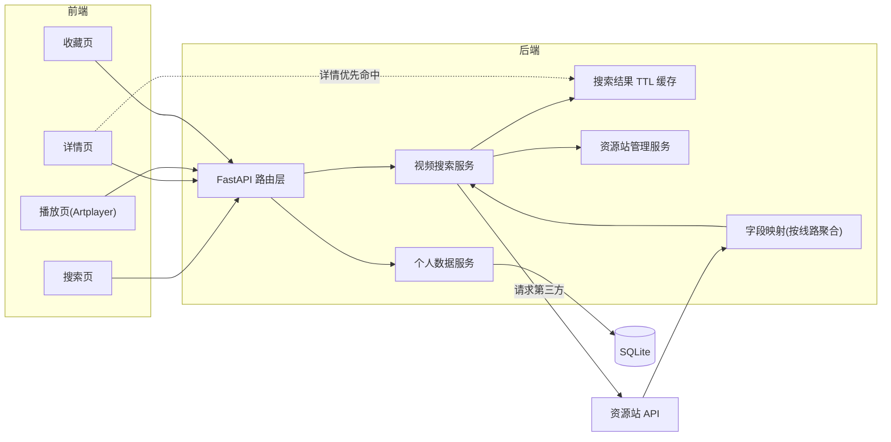
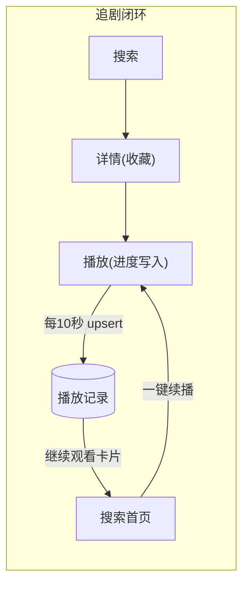
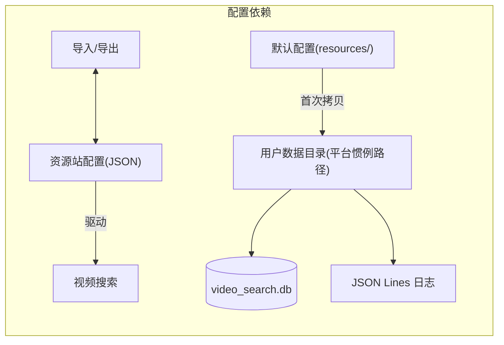
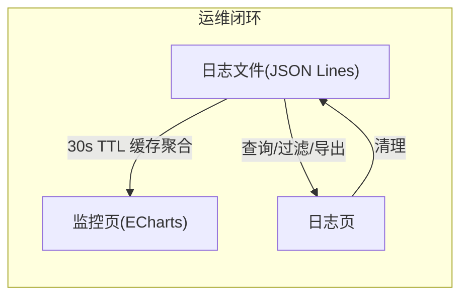

# VideoSearch — 模块说明文档

> 本文档说明系统的业务功能设计、模块边界和协作关系。
> `doc/项目结构文档.md` 负责说明代码组织，本文档负责说明业务模块如何支撑产品能力。
> 更新日期：2026-07-31
>
> **项目基础信息**（版本以 `package.json`、`frontend/package.json`、`backend/pyproject.toml` 等依赖清单为准）：
>
> | 类别 | 技术 | 版本 | 用途 |
> | --- | --- | --- | --- |
> | 语言运行时 | Python | >=3.11 | 后端运行语言 |
> | 后端框架 | FastAPI | >=0.115.0 | RESTful API 框架 |
> | 后端框架 | Uvicorn | >=0.30.0 | ASGI 服务器 |
> | 数据层 | SQLAlchemy | >=2.0.51 | ORM，SQLite 持久化（WAL 模式） |
> | 数据层 | SQLite | Python 内置 | 本地数据库 |
> | 配置管理 | pydantic-settings | >=2.4.0 | 统一配置，支持环境变量与 .env |
> | HTTP 客户端 | httpx | >=0.27.0 | 异步请求第三方资源站 |
> | 构建打包 | PyInstaller | >=6.0.0 | 后端单文件打包（构建期） |
> | 前端框架 | Vue 3 | ^3.5.13 | UI 框架（Composition API） |
> | 前端框架 | Pinia / Vue Router | ^3.0.1 / ^4.5.0 | 状态管理 / 路由 |
> | 构建工具 | Vite / @vitejs/plugin-vue | ^6.0.7 / ^5.2.1 | 前端构建与开发服务器 |
> | 样式 | Tailwind CSS / PostCSS / Autoprefixer | ^3.4.17 / ^8.5.1 / ^10.4.20 | 原子化样式与 CSS 处理管道 |
> | 前端依赖 | Axios / Artplayer / HLS.js / ECharts / FontAwesome 6 | ^1.7.9 / ^5.4.0 / ^1.5.20 / ^5.5.1 / ^6.7.2 | 请求封装、播放器、流媒体、图表、图标 |
> | 代码质量 | ESLint / eslint-plugin-vue | ^9.18.0 / ^9.32.0 | 前端静态检查 |
> | 桌面端 | Electron / electron-builder | ^43.2.0 / ^26.15.3 | 桌面壳 / 打包分发 |

---

## 1. 文档定位

本文档面向参与 VideoSearch 开发的工程师，帮助理解系统的业务模块划分、各模块的职责边界以及模块间的协作关系。阅读前建议先了解 `doc/项目结构文档.md` 中的代码组织结构，再通过本文档理解各模块的业务语义。两个文档互补：一份回答"代码如何组织"，一份回答"业务边界在哪里"。

## 2. 系统功能定位

VideoSearch 是一个桌面端视频聚合搜索工具，帮助用户在一个界面内通过关键词同时搜索多个第三方视频资源站，聚合展示结果、查看视频详情、多线路播放，并沉淀搜索历史、收藏和播放进度等个人数据支撑追剧场景。

系统围绕以下核心能力方向设计：

| 能力方向 | 业务目标 |
|---------|---------|
| 多源聚合搜索 | 一次输入，并发查询所有已启用资源站，站点级状态实时可见，失败可单站重试 |
| 资源站管理 | 站点的增删改、启停、连接测试（单站/批量）与配置导入导出 |
| 视频元信息展示 | 展示海报、演员、导演、评分、简介、按线路分组的播放源，辅助用户决策 |
| 多线路播放 | 按线路组织播放源，支持线路切换、倍速、自动连播等播放控制 |
| 个人数据沉淀 | 搜索历史、视频收藏、播放进度记忆与续播，支撑"继续观看"体验 |
| 运行监控 | 基于本地日志聚合搜索趋势、站点性能、热门关键词，辅助运维判断 |

## 3. 端侧职责划分

| 端侧 | 职责定位 | 设计关注点 |
|------|---------|-----------|
| 桌面壳（Electron） | 窗口管理与后端进程生命周期编排 | 后端子进程的启动、健康检查、启动失败错误对话框（重试/退出）、优雅关闭；窗口控制；IPC 桥接 |
| 前端界面（Vue 3） | 用户交互与状态管理 | 站点级搜索状态流转、请求取消与竞态防护、Artplayer 播放控制、全局 Toast/Modal 反馈；响应式布局 |
| 后端服务（FastAPI） | RESTful API 提供服务 | 资源站配置 CRUD、第三方 HTTP 请求封装（共享连接池）、搜索结果 TTL 缓存、个人数据读写、日志聚合统计 |
| 本地数据库（SQLite） | 个人数据持久化 | 搜索历史、收藏、播放记录三张表；WAL 模式；服务层负责事务提交与回滚 |
| 外部资源站 | 第三方视频数据源（JSON API） | 多站点异构接口适配（参数字段映射、响应结构解析、线路与格式识别） |
| 本地文件系统 | 持久化资源站配置与 JSON Lines 日志 | 数据目录按平台惯例定位；配置读写异常处理、日志轮转与清理 |

## 4. 功能模块总览

| 模块 | 定位 | 核心产出 |
|------|------|---------|
| 视频搜索 | 系统的核心业务入口 | 多站点并发搜索、站点状态可视化、失败重试、搜索历史联动 |
| 资源站管理 | 视频搜索的数据源配置 | 站点增删改与启停、连接测试（单站/并发批量）、配置导入导出 |
| 视频详情与播放 | 搜索结果的下游消费 | 元信息展示、按线路分组的播放源、Artplayer 播放、自动连播与续播 |
| 个人数据 | 用户使用痕迹的持久化沉淀 | 搜索历史、收藏夹、播放记录与"继续观看"入口 |
| 系统监控 | 运行状态聚合分析 | 仪表板概览、ECharts 趋势图表、站点性能、热门关键词 |
| 系统日志 | 运维支撑 | 日志浏览、过滤、统计、导出（JSON/CSV）、清理 |
| 桌面壳 | 应用载体 | 窗口管理、后端进程编排、启动失败兜底、IPC 通信 |

## 5. 各业务模块说明

### 5.1 视频搜索模块

**定位**：用户输入关键词后，系统并发向所有已启用资源站发起搜索请求，站点级状态实时反馈并聚合返回结果。

**核心功能**：
- 输入关键词并校验是否为空，搜索发起时自动记录搜索历史
- 搜索历史下拉：输入框聚焦展示最近记录，支持点击复搜、删除单条、清空全部
- 并发向所有已启用站点发起异步请求，侧栏实时展示每个站点的状态流转（搜索中 → 成功/失败）
- 失败站点在侧栏内联展示，点击即可单站重试，不影响其他站点结果
- 新搜索自动取消上一次未完成的请求，消除竞态
- 过滤非法类型（预告片、电影解说、影视解说），字段映射统一结构
- 支持单站翻页搜索；前端 2 小时搜索缓存（localStorage，带版本号与写入保护）恢复

**设计边界**：
- 只负责搜索请求的分发和结果聚合，不负责播放源的直接渲染
- 搜索结果的过滤仅限于类型名称过滤，不涉及内容层面的审核或排序
- 搜索历史的持久化由个人数据模块负责，本模块只负责触发记录与展示

**关联模块**：资源站管理（获取站点配置）、个人数据（历史记录读写）、视频详情与播放（消费搜索结果）

**开发关注点**：
- 一个站点超时不阻塞其他站点；站点状态流转（loading/success/failed）必须与结果集保持一致
- 第三方资源站的 API 响应结构差异较大，字段映射逻辑需持续适配
- localStorage 缓存结构变更时必须递增版本号，旧缓存自动失效
- 后端对每次成功搜索写入 10 分钟 TTL 缓存，供详情接口命中

### 5.2 资源站管理模块

**定位**：管理第三方视频资源站的配置清单，控制哪些站点参与搜索。

**核心功能**：
- 从本地 JSON 配置文件加载资源站列表（默认配置内置在应用资源中，首次启动拷贝到用户数据目录）
- 站点的新增、编辑、删除（弹窗表单，删除需二次确认）
- 切换单个站点的启用/禁用状态；站点列表名称过滤
- 单站连接测试（固定测试关键词，结果可复现）；批量测试由后端并发执行（信号量限流）
- 配置导出为 JSON 文件、从 JSON 文件导入（整体覆盖）

**设计边界**：
- 连接测试只验证 API 连通性和响应结构是否符合预期，不验证视频内容可用性
- 导入采用整体覆盖策略，不做与现有配置的合并
- 配置异常时回退方式明确：优先使用用户目录的可写副本，不存在则从默认配置拷贝

**关联模块**：视频搜索（提供站点列表和启停状态）

**开发关注点**：
- 配置文件 I/O 异常需妥善处理（读写失败时不能使后端崩溃）
- 批量测试的并发数由配置项控制，避免对第三方站点造成压力
- 后端响应校验中检测反爬机制的规则需要随着第三方站点的变化而更新
- 站点表单校验（必填项、超时范围）在前端完成，后端 Schema 做二次约束

### 5.3 视频详情与播放模块

**定位**：展示选定视频的元信息，按线路组织播放源并提供完整播放体验。

**核心功能**：
- 详情优先命中后端搜索结果缓存（TTL 10 分钟），未命中才重新搜索并按视频 ID 匹配
- 展示视频元信息：海报（加载失败降级占位）、标题、简介（已清洗 HTML）、演员、导演、评分、总集数、更新时间等
- 播放源**按线路分组**展示，每条线路携带格式标识（m3u8/mp4 等），多线路可切换
- 基于 Artplayer 的播放器：倍速、音量/倍速记忆、快捷键、画中画、全屏、HLS 流媒体
- 自动连播下一集（可开关，偏好本地记忆）；播放错误 Toast 提示
- 播放进度定时写入播放记录，重新进入自动续播并提示

**设计边界**：
- 详情获取仍以"搜索+ID 匹配"为兜底（第三方接口形态所限），但常规路径由缓存承担
- 播放器不处理 DRM、字幕等高级功能；播放源 URL 的有效性由实际加载判断
- 播放进度的持久化由个人数据模块的播放记录承载，本模块负责触发写入与消费续播

**关联模块**：视频搜索（缓存与搜索结果来源）、个人数据（收藏与播放记录）

**开发关注点**：
- 播放源为按线路聚合的数组结构（线路名 + 格式 + 剧集列表），前后端契约一致，不得回退为按格式合并
- 线路切换保持当前集索引，新线路集数不足时回退到首集
- Artplayer 实例的创建与销毁必须与 URL 切换严格配对，HLS 实例随播放器销毁
- 进度写入按时间节流（约 10 秒一次），暂停与页面卸载时强制写入
- 播放格式识别的特征列表应随新格式持续追加

### 5.4 个人数据模块

**定位**：以 SQLite 为承载，沉淀用户的搜索历史、收藏和播放记录，支撑个性化入口。

**核心功能**：
- 搜索历史：关键词唯一记录，重复搜索累加次数并前置排序；支持删除单条与清空
- 收藏：以"站点+视频"唯一标识收藏项，保存标题、海报、类型等快照与来源关键词；独立收藏页分页浏览
- 播放记录：以"站点+视频"唯一标识，upsert 保存线路、剧集索引、播放位置与总时长
- "继续观看"：搜索首页顶部展示最近播放记录卡片，点击直达对应剧集并续播

**设计边界**：
- 所有个人数据只存本地 SQLite，不做云同步与多用户隔离（单机单用户）
- 收藏与播放记录保存的是快照数据，视频源信息变化时不自动刷新快照
- 收藏项跳转详情依赖收藏时保存的关键词重新定位视频

**关联模块**：视频搜索（历史联动）、视频详情与播放（收藏入口、进度写入与续播）

**开发关注点**：
- 数据库读写必须经服务层的会话管理与事务辅助，遵守后端规范的事务规则
- 播放记录 upsert 需保证"内容未变化时也刷新更新时间"，否则继续观看排序会失真
- 快照字段（标题/海报）允许为空，前端展示需有占位兜底
- 表结构变更直接改模型并删库重建，不写迁移脚本

### 5.5 系统监控模块

**核心功能**：
- 仪表板概览：搜索次数、成功率、平均响应时间、错误数
- 按小时聚合的搜索趋势（ECharts 柱状图，含 tooltip 与坐标轴）
- 站点性能表格（请求数、成功率、平均响应时间）；热门关键词（ECharts 横向条形图）
- 系统健康状态（基于错误数和警告数判定 healthy/warning/error）
- 30 秒自动刷新，支持暂停/恢复；手动刷新有成功反馈

**设计边界**：
- 所有数据基于本地 JSON Lines 日志聚合，不依赖外部监控系统
- 聚合结果有 30 秒进程内 TTL 缓存，同一批日志在一次仪表盘刷新中只读取解析一遍
- 监控数据的准确性依赖日志记录的完整性——日志被清理后历史数据消失（最多滞后 30 秒生效）

**关联模块**：系统日志（作为数据来源）

**开发关注点**：
- 新增聚合维度必须复用缓存读取入口，不得绕过缓存直接读日志文件
- 趋势分桶键为完整时间格式，跨天跨年不撞桶；展示用短标签由后端下发
- 热门关键词的提取依赖 URL Query 解析，站点搜索参数名变化会影响统计
- 前端图表实例需在组件卸载时销毁并移除 resize 监听

### 5.6 系统日志模块

**核心功能**：
- 日志列表浏览（支持分页）；多维度过滤：类型、级别、时间范围、关键词
- 日志统计：按类型和级别汇总数量
- 日志导出：按当前过滤条件导出 JSON 或 CSV 文件
- 日志详情弹窗（通用 Modal，支持复制完整日志）
- 日志清理（含轮转备份，二次确认，不可恢复）

**设计边界**：
- 只读取和展示日志，不写入日志（日志写入由后端日志模块统一管理）
- 日志文件采用轮转策略（RotatingFileHandler），轮转备份纳入读取与清理范围
- 导出接口返回文件流，是统一响应壳之外的唯一例外形态

**关联模块**：系统监控（作为底层数据源被监控模块读取）

**开发关注点**：
- 关键词过滤基于读取时保留的原始行文本匹配，禁止对每条日志重新序列化
- 日志行解析需容错（单行 JSON 解析失败不影响其他行）
- 统计接口一次读取同时产出全量统计与 24 小时错误数，避免重复读文件
- 导出内容可能较大，前端使用 blob 下载并及时释放对象 URL

### 5.7 桌面壳模块

**核心功能**：
- 创建和管理无边框应用窗口（1280×820，最小 1024×680）
- 启动后端 FastAPI 子进程（开发环境使用 Uvicorn，打包后从后端可执行文件启动）
- 后端健康检查轮询（最长等待 15 秒）；启动失败弹出原生错误对话框，支持重试或退出
- 后端进程的优雅关闭（`before-quit` 事件拦截）
- IPC 通信：应用信息、后端地址、窗口控制、窗口状态变更通知

**设计边界**：
- 不参与前端业务逻辑，职责仅限于进程编排和窗口管理
- 后端进程管理假设单实例运行，不处理多实例冲突
- 启动失败兜底只覆盖"后端起不来"场景，运行中的后端崩溃由前端网络错误提示承担

**关联模块**：所有其他模块（作为载体提供运行环境）

**开发关注点**：
- 后端进程的启动路径需区分开发环境和打包后的路径
- 重试启动前必须先停止残留子进程，避免端口占用
- 窗口关闭时需先等待后端进程停止再退出，`before-quit` 事件处理需防重入
- 预加载脚本中的 IPC 通道需保持与前端的约定一致

## 6. 通用支撑能力

| 能力 | 职责 | 使用原则 |
|------|------|---------|
| SQLite 数据层 | 提供数据库引擎、会话管理、事务辅助与建表入口 | 个人数据读写必须走服务层 + 会话注入；服务层负责提交回滚，会话管理不隐式提交；开发时应避免绕过服务层直接操作数据库 |
| 统一 HTTP 请求工具 | 应用级共享异步 HTTP 客户端（随应用生命周期管理），自动记录请求日志、计时、异常转换 | 视频搜索和连接测试均通过共享客户端发送请求；开发时应避免临时创建新客户端破坏连接池复用 |
| 视频字段映射工具 | 解析第三方异构响应，按线路聚合播放源、清洗 HTML、提取视频条目与总数 | 适配新资源站时优先修改映射规则而非调用侧；线路聚合结构是前后端契约，不得私自变更 |
| 进程内 TTL 缓存 | 搜索结果缓存（10 分钟）与监控聚合缓存（30 秒），纯字典实现无外部依赖 | 详情与监控必须优先走缓存入口；缓存值视为只读，不得原地修改 |
| 统一响应与错误处理 | 后端统一响应结构与错误码体系；前端请求错误对象保留业务码、HTTP 状态、超时/网络标记 | API 层必须使用统一返回方式（文件下载除外）；前端按错误类型分流提示，避免把所有错误压扁成一句"请求失败" |
| JSON Lines 日志系统 | 为整个应用提供结构化日志，支持日志轮转、请求日志记录 | 开发时应避免手动拼接日志字符串、在非日志模块中直接处理日志文件 I/O |
| 通用前端组件 | 提示、空状态、加载状态、分页、消息、弹窗、确认七种基础 UI 组件 | 瞬时反馈用消息提示，阻断确认用确认弹窗，禁止使用浏览器原生弹窗；空/加载/错误状态优先复用组件而非自建 |
| Axios 请求封装 | 统一配置请求地址、超时、拦截器，支持 Electron 预加载环境与文件下载（二进制流）透传 | 业务组件不关心地址来源；文件下载响应不做统一解包，由调用方处理下载 |
| 前端状态管理 | 资源站、搜索、视频、消息四个 Pinia Store | Store 是业务的单点入口；搜索缓存与站点状态由搜索 Store 统一管理；播放器实例状态保持在组件内不入 Store |

## 7. 模块间关键关系

**图说明**：搜索链路写入 TTL 缓存，详情链路优先命中缓存避免二次搜索；播放与收藏产生的个人数据统一经个人数据服务落入 SQLite。

**图说明**：播放进度持续沉淀为播放记录，通过首页"继续观看"形成完整的追剧闭环。

**图说明**：用户数据目录按平台惯例定位（macOS 为 Application Support），统一承载配置、数据库与日志三类持久化数据。

**图说明**：日志"一次写入、多次读取"，监控聚合经 TTL 缓存共享同一次日志解析。

## 8. 典型业务闭环

### 闭环一：搜索并浏览视频

1. 用户在搜索页输入关键词（可从历史下拉直接选择），点击搜索
2. 系统记录搜索历史，并对所有已启用站点并发发起搜索
3. 侧栏立即列出全部参与站点，实时流转"搜索中 → 成功（结果数）/ 失败（可重试）"状态
4. 用户切换站点 Tab 查看结果、翻页；失败站点点击即可单站重试
5. 点击结果卡片进入详情页，详情优先命中后端缓存即时返回
6. 查看元信息与按线路分组的播放源，选择线路和剧集进入播放

### 闭环二：追剧与续播

1. 用户在播放页观看视频，进度每约 10 秒自动写入播放记录
2. 一集播完自动连播下一集（可关闭）；可随时切换线路或剧集
3. 用户退出应用后再次打开，搜索首页顶部"继续观看"展示最近播放的视频卡片
4. 点击卡片直达对应线路与剧集，自动跳转到上次播放位置并提示
5. 不再追的剧可在卡片上直接删除播放记录

### 闭环三：收藏管理

1. 用户在视频详情页点击收藏按钮，系统保存视频快照与来源关键词
2. 顶部导航进入收藏页，分页浏览全部收藏
3. 点击收藏卡片经保存的关键词重新定位并进入详情页
4. 在详情页或收藏页均可取消收藏

### 闭环四：管理资源站与连接测试

1. 用户在设置页查看资源站列表及统计，可按名称过滤
2. 通过弹窗表单新增或编辑站点，删除需二次确认
3. 对单个站点或全部已启用站点进行连接测试（固定关键词，后端并发执行），结果实时展示
4. 可将当前配置导出为 JSON 文件备份，或从文件导入整体覆盖
5. 全部变更自动保存到用户数据目录，重启后保持

### 闭环五：系统运行监控与日志运维

1. 用户进入监控页选择时间窗口（6/24/72 小时），查看概览卡片、ECharts 趋势图、站点性能与热门关键词
2. 自动刷新每 30 秒执行一次，可暂停/恢复；后端聚合走 30 秒 TTL 缓存
3. 进入日志页按类型/级别/时间/关键词过滤浏览，点击行查看详情弹窗并可复制完整日志
4. 可按当前过滤条件导出 JSON/CSV 文件
5. 日志清理需二次确认（含轮转备份），清理后监控历史数据随之消失

## 9. 后续开发参考原则

1. **新资源站优先适配字段映射，不动调用链路**：第一修改点是第三方响应的字段映射与线路解析规则，而非搜索服务或接口层
2. **播放源以线路为单位组织**：播放源是"线路名 + 格式 + 剧集列表"的数组契约，格式是线路的属性；不得回退为按格式合并，否则多线路切换失效
3. **并发请求的失败不阻塞整体**：一个资源站超时或异常不应中断其他站点，站点状态流转必须与结果集一致
4. **个人数据一律进 SQLite**：搜索历史、收藏、播放记录必须经服务层落库；localStorage 只承载界面态（搜索缓存、播放器偏好），且缓存结构变更必须升版本号
5. **数据库操作遵守事务规范**：服务层负责事务提交与回滚，模型变更直接改表并删库重建，不写迁移脚本
6. **日志是监控的唯一数据源，聚合必须走缓存入口**：新增监控维度先扩展日志字段，聚合必须复用缓存的日志读取入口，不绕过缓存读文件
7. **配置读写路径固定**：资源站配置的读写入口只有资源站服务中的加载与保存函数，导入导出也复用它们
8. **HTTP 请求复用共享客户端**：任何新的第三方请求都复用共享客户端，不临时创建新的连接池
9. **用户反馈组件分级使用**：瞬时结果用消息提示，阻断确认用确认弹窗，页面级错误用提示组件（附重试）；禁止浏览器原生弹窗
10. **播放器状态保持在组件内**：播放器实例、播放进度等状态保持在播放页组件内部，不提升到全局状态；实例销毁与 URL 切换严格配对
11. **文件 I/O 异常必须有兜底**：配置文件、日志文件和数据库文件的操作必须被异常保护，失败时不能使后端进程退出
