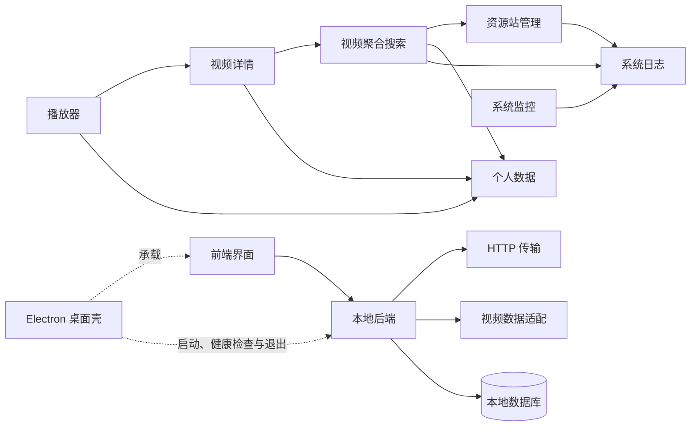
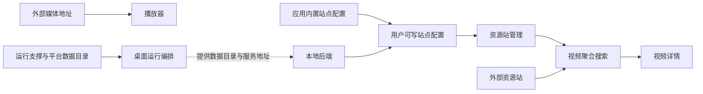
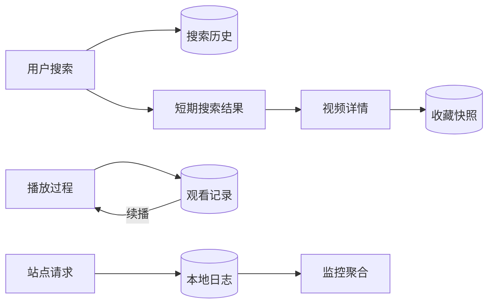

# VideoSearch — 模块说明文档

> 本文档说明系统的业务功能设计、模块边界和协作关系。
> `doc/项目结构文档.md` 负责说明代码组织，本文档负责说明业务模块如何支撑产品能力。
> 更新日期：2026-08-11
>
> **项目基础信息**（版本取自当前依赖清单与锁文件）：
>
> | 类别 | 技术 | 版本 | 用途 |
> |---|---|---|---|
> | 项目版本 | VideoSearch | 0.1.0 | 桌面应用与前后端统一版本 |
> | 后端语言运行时 | Python | >=3.11 | 本地服务运行环境 |
> | 后端框架 | FastAPI / Uvicorn | 0.136.1 / 0.46.0 | 本地接口服务与 ASGI 运行 |
> | 数据与配置 | SQLAlchemy / pydantic-settings | 2.0.51 / 2.14.1 | 本地数据访问与运行配置 |
> | 本地数据库 | SQLite | 版本未固定（随 Python 运行时提供） | 保存搜索历史、收藏和播放记录 |
> | 外部请求 | HTTPX | 0.28.1 | 访问第三方视频资源站 |
> | 后端打包 | PyInstaller | 6.20.0 | 生成桌面应用携带的后端可执行文件 |
> | 前端框架 | Vue / Pinia / Vue Router | 3.5.34 / 3.0.4 / 4.6.4 | 界面、业务状态与页面导航 |
> | 前端请求 | Axios | 1.16.0 | 调用本地后端服务 |
> | 播放能力 | Artplayer / HLS.js | 5.4.0 / 1.6.16 | 视频控制与 HLS 流媒体播放 |
> | 数据可视化 | ECharts | 5.6.0 | 搜索趋势与热门关键词图表 |
> | 图标 | FontAwesome / Vue 适配层 | 6.7.2 / 3.2.0 | 全局界面图标与 Vue 组件集成 |
> | 前端构建与样式 | Vite / Tailwind CSS / PostCSS | 6.4.2 / 3.4.19 / 8.5.14 | 前端构建、样式生成与 CSS 处理 |
> | 桌面端 | Electron / electron-builder | 43.2.0 / 26.15.3 | 桌面窗口、进程编排与 Windows 分发 |
> | 工具运行时 | Node.js / npm / uv | 版本未固定 | JavaScript 依赖、构建与 Python 环境管理 |
> | 外部运行时依赖 | 第三方视频资源站及其媒体地址 | 版本未固定 | 提供检索数据、视频元信息和播放内容 |

---

## 1. 文档定位

本文档面向产品维护者和开发人员，用于判断一项需求应归属哪个业务模块、会影响哪些上下游能力。项目结构导航文档回答“代码在哪里”，本文档回答“系统提供什么能力以及模块如何协作”；建议先了解系统定位与模块总览，再按目标业务闭环阅读具体模块。

## 2. 系统功能定位

VideoSearch 是一款本机运行的视频聚合搜索桌面工具，帮助单机用户统一检索多个第三方资源站，查看视频信息、选择线路播放，并在本地保留搜索、收藏和观看进度。

| 能力方向 | 业务目标 |
|---|---|
| 多源聚合检索 | 一次输入关键词即可查看多个已启用资源站的独立结果和状态，单站失败不阻断其他结果。 |
| 资源站治理 | 允许用户维护参与检索的来源，控制启停、验证连通性并备份或恢复配置。 |
| 视频信息理解 | 将不同站点返回的信息整理为一致的标题、海报、简介、演职员和剧集线路视图。 |
| 多线路播放 | 让用户按线路与剧集选择播放内容，并保留常用播放偏好。 |
| 个人内容沉淀 | 在本机保存搜索历史、收藏和播放位置，形成复搜、回访和续播入口。 |
| 运行可观测性 | 通过本地结构化日志展示请求量、成功率、响应耗时、站点表现和错误情况。 |
| 桌面一体化运行 | 由桌面应用统一启动本地服务、确认服务可用并管理窗口与退出过程。 |

## 3. 端侧职责划分

| 端侧 | 职责定位 | 设计关注点 |
|---|---|---|
| 桌面壳 | 为用户提供独立桌面窗口，并编排本地后端的启动、就绪检查和退出 | 启动失败可恢复、子进程不残留、窗口能力只通过受控桥接开放；现有成品分发配置面向 Windows |
| 前端界面 | 承载搜索、设置、详情、播放、收藏、监控和日志等用户交互 | 多请求状态隔离、旧请求取消、加载/空/错误反馈、播放器资源释放和桌面/浏览器环境兼容 |
| 本地后端 | 统一处理资源站配置、外部请求、数据映射、个人数据和日志统计 | 外部站点失败隔离、输入输出校验、共享连接复用、错误信息收敛和本地文件异常兜底 |
| 本地数据库 | 持久化用户的搜索历史、收藏和观看进度 | 单机单用户、唯一性约束、事务一致性和最近使用时间排序 |
| 本地文件系统 | 保存可写资源站配置、结构化日志和数据库文件 | 首次初始化、平台数据目录、轮转文件管理和导入覆盖的可预期性 |
| 外部资源站 | 提供搜索结果、视频元信息、线路和媒体地址 | 接口结构差异、超时或反爬响应、内容变化、线路可用性和服务不可控性 |

## 4. 功能模块总览

| 模块层级 | 定位 | 核心产出 | 直接依赖 |
|---|---|---|---|
| 内容发现 / 资源站管理 | 决定系统从哪些外部来源获取内容 | 可用站点清单、启停状态、连接测试结果和可导入导出的配置 | 本地配置、外部资源站、日志支撑 |
| 内容发现 / 视频聚合搜索 | 将一次关键词输入分发到多个已启用站点 | 按站点隔离的结果、分页信息、完成状态和失败重试入口 | 资源站管理、外部请求与数据适配、搜索历史、日志支撑 |
| 内容消费 / 视频详情 | 将搜索结果转化为可理解的统一视频信息和播放线路 | 视频元信息、线路与剧集列表、详情入口 | 视频聚合搜索、数据适配 |
| 内容消费 / 播放器 | 承载线路、剧集选择和媒体播放过程 | 播放器状态、播放控制、自动连播和续播位置 | 视频详情、个人数据、外部媒体地址 |
| 个人数据（父模块） | 保存用户复搜、回访和续播所需的信息 | 搜索历史、收藏快照、播放位置和继续观看入口 | 本地数据库；被搜索、详情与播放子模块调用 |
| 可观测性 / 系统日志 | 为运行排障和统计提供本地事实记录 | 可筛选日志、分类统计、详情、导出文件和清理结果 | 统一日志支撑 |
| 可观测性 / 系统监控 | 将运行日志转化为可读的健康和性能指标 | 请求概览、趋势、站点表现、热门关键词和健康状态 | 系统日志 |
| 运行支撑 / 桌面运行编排 | 将前端和本地后端组合成可使用的桌面应用 | 可用窗口、后端就绪状态、桌面控制能力和退出清理 | 前端界面、本地后端、运行配置和打包资源 |

模块层级与代码目录不是一一对应关系：业务模块按用户目标划分，技术支撑按运行职责划分。个人数据、可观测性和内容消费保留父模块，下面的子模块在 API、Service、Store 或页面层分别实现；桌面运行编排、健康检查和基础请求能力属于运行支撑，不属于内容业务。

```text
业务模块
├── 内容发现：资源站管理、多站聚合搜索
├── 内容消费：视频详情、播放器
├── 个人数据：搜索历史、收藏、播放记录
└── 可观测性：系统日志、系统监控

运行支撑
├── Electron 桌面壳与后端生命周期
├── 健康检查
├── HTTP 请求与第三方数据适配
├── 数据库与平台数据目录
└── 基础 UI、前端请求和错误边界
```

## 5. 业务模块与运行支撑说明

### 5.1 资源站管理模块

**定位**：让用户决定哪些第三方来源参与检索，并在搜索前确认来源配置和基础连通性。

**核心功能**：
- 查看全部站点及启用、禁用数量，并按名称快速过滤。
- 新增、编辑和删除自定义站点，配置站点名称、地址、超时和请求参数约定。
- 单独启用或禁用某个站点，禁用站点不参与后续搜索和批量测试。
- 对单个站点执行连接测试，展示成功、失败和响应耗时。
- 对全部已启用站点执行受控并发测试，汇总成功与失败数量。
- 将当前配置导出为本地文件，或从符合约定的文件整体导入。
- 首次运行时从应用自带配置建立用户可写副本，后续变更保留在本机。

**设计边界**：
- 连接测试只确认接口能够返回可识别的数据，不保证每个视频或播放地址都长期有效。
- 配置导入采用整体覆盖，不负责与现有站点自动合并。
- 本模块不负责搜索结果排序、视频字段清洗或实际媒体播放。

**依赖与协作**：
- 本模块依赖本地配置持久化；执行测试时依赖外部资源站和统一请求、日志能力。
- 视频聚合搜索依赖本模块提供的启用站点集合和每站请求约定。
- 桌面运行编排负责提供可写数据目录，但不参与站点业务规则。

**开发关注点**：
- 任何配置读写失败都应转化为可理解的错误，不能导致本地服务退出。
- 新增或导入配置必须保证站点标识唯一，并再次执行服务端校验。
- 批量测试必须限制并发，单站异常不得中断其他站点。
- 配置格式变更必须同时考虑默认配置、用户副本和导入导出的一致性。

### 5.2 视频聚合搜索模块

**定位**：让用户用一次关键词输入并行检索所有已启用来源，并独立查看每个站点的结果和执行状态。

**核心功能**：
- 校验关键词，并在搜索启动后记录可供复用的搜索历史。
- 同时向多个启用站点发起请求，按完成顺序逐步展示结果。
- 对每个站点分别展示搜索中、成功或失败状态，避免整体等待后一次性反馈。
- 允许用户单独重试失败站点，不清除其他站点已经得到的结果。
- 新搜索启动时取消尚未完成的旧搜索，避免旧结果覆盖新关键词。
- 支持对当前站点单独翻页，并保留其他站点已有结果。
- 过滤不需要展示的内容类型，并统一第三方站点的元信息与播放线路表达。
- 在本地短期恢复最近搜索界面，并短期复用后端搜索结果以支撑详情访问。

**设计边界**：
- 聚合发生在用户端状态层，各站点仍是相互独立的搜索任务，不生成跨站去重或统一排序结果。
- 内容过滤仅依据当前明确的类型规则，不承担内容审核和语义相关度计算。
- 搜索模块产出可进入详情的候选项，不负责播放器实例和观看进度。

**依赖与协作**：
- 本模块依赖资源站管理提供启用站点和请求约定，依赖外部请求与数据适配能力获取统一结果。
- 本模块向个人数据模块写入搜索历史，并向系统日志输出站点请求事实。
- 内容消费模块依赖本模块提供的搜索上下文和短期结果。

**开发关注点**：
- 站点级状态、结果和失败原因必须使用同一站点标识关联，不能发生串站。
- 新旧搜索必须有明确隔离；取消旧请求后不得继续写入当前界面状态。
- 单站超时、异常响应或字段缺失不能阻断其他站点。
- 缓存结构变化必须显式失效旧数据，缓存写入失败不得影响搜索主流程。
- 分页总数来自第三方数据，展示时应容忍站点统计不准确或结果为空。

### 5.3 内容消费模块

**定位**：帮助用户理解所选视频内容，按线路和剧集做出选择，并完成连续、可恢复的本地播放体验。

本模块由两个职责清晰但连续协作的子模块组成：**视频详情**负责元信息、线路和收藏入口；**播放器**负责媒体实例、线路/剧集切换、播放偏好和进度续播。二者共享视频状态，但不应合并成一个页面或一个长期增长的业务服务。

**核心功能**：
- 展示标题、海报、简介、类型、年份、地区、语言、状态、评分、导演、演员和更新时间等信息。
- 海报无法加载时显示统一占位，不影响详情与播放入口。
- 将播放源按线路分组，展示线路名称、媒体格式和各线路剧集数量。
- 允许用户选择线路与剧集，并在播放过程中切换；新线路集数不足时回退到有效剧集。
- 支持 HLS 和普通媒体地址播放，以及倍速、快捷键、画中画和全屏等控制。
- 记住音量、倍速和自动连播偏好，并在当前剧集结束时按用户设置进入下一集。
- 定期保存当前线路、剧集、播放位置和时长，在暂停或离开页面时补充保存。
- 当已有匹配记录时恢复上次位置，并通过用户提示说明续播结果。

**设计边界**：
- 视频详情依赖搜索关键词和结果页定位；当前收藏与播放记录只保留关键词，回访时会从首个结果页重新查找。
- 播放模块不保证第三方媒体地址有效，也不提供 DRM、字幕管理或离线下载。
- 播放失败只在当前线路与地址范围内反馈，不自动替用户选择其他来源。

**依赖与协作**：
- 本模块依赖视频聚合搜索提供详情上下文和统一线路结构。
- 本模块读取并写入个人数据中的收藏状态与播放记录。
- 实际播放依赖外部媒体地址，桌面运行编排只提供承载环境。

**开发关注点**：
- 播放源必须始终以“线路包含剧集”的语义组织，不能把不同线路仅按格式合并。
- 每次地址切换都必须释放旧播放器及流媒体资源，避免重复播放和内存泄漏。
- 续播只应用到匹配的线路与剧集，不能把旧位置错误带到另一集。
- 进度保存需要节流，同时覆盖暂停、播放结束和页面离开等边界。
- 路由中的线路、剧集和当前播放状态应保持一致，保证返回详情和刷新后的定位可理解。

### 5.4 个人数据模块

**定位**：在单机环境中沉淀用户的搜索、收藏和观看痕迹，降低重复查找成本并形成持续观看入口。

本模块是业务父模块，代码上继续拆分为三个独立子模块：**搜索历史**、**收藏**和**播放记录**。它们共享本地数据库和事务约束，但公开接口、数据生命周期和调用方不同，不应合并为单个 Service。

**核心功能**：
- 保存最近搜索关键词；重复关键词累计使用次数并更新到最近位置。
- 在搜索输入区域展示近期历史，支持点击复搜、删除单条和清空历史。
- 以站点和视频组合为唯一标识保存收藏，重复收藏保持幂等。
- 保存收藏时的视频标题、海报、类型、状态和检索上下文快照。
- 分页浏览收藏，并从收藏项重新进入视频详情或取消收藏。
- 以站点和视频组合为唯一标识持续更新最近线路、剧集和播放位置。
- 在搜索首页展示最近观看内容，支持一键续播和删除单条观看记录。

**设计边界**：
- 所有数据仅保存在本机，不提供账号、多用户隔离、云同步或跨设备恢复。
- 收藏和观看记录保存的是当时快照，不主动同步第三方站点后续变更。
- 收藏与观看记录不保存原搜索页码；非首屏结果或外部内容变化后，回访可能无法重新定位。
- 一个视频只保留一条最新观看状态，不保存完整逐次观看轨迹。

**依赖与协作**：
- 本模块依赖本地数据库和统一事务处理。
- 视频聚合搜索写入并读取搜索历史；详情模块读写收藏；播放模块读写观看记录。
- 桌面运行编排提供应用数据目录，本模块不决定目录位置和生命周期。

**开发关注点**：
- 收藏和观看记录的唯一性必须以站点与视频组合判断，不能只使用视频标识。
- 更新观看内容时即使位置数值相同也要刷新最近使用时间，保证继续观看排序正确。
- 写入失败必须完整回滚，不能留下半更新状态。
- 快照字段可能为空，所有消费页面都需要占位和降级展示。
- 数据结构调整应遵循当前开发期直接重建数据库的项目约定，不虚构迁移能力。

### 5.5 可观测性模块

可观测性由系统日志和系统监控两个子模块组成：日志保存原始运行事实，监控只基于日志生成派生指标。两者在业务上相关，但在实现上保持单向依赖，避免监控逻辑侵入日志读写和清理。

#### 5.5.1 系统监控子模块

**定位**：把本地运行记录转换为用户可读的请求表现和健康概览，帮助判断问题集中在哪个站点或时间段。

**核心功能**：
- 展示搜索相关站点请求量、成功率和平均响应时间摘要。
- 按可选时间窗口展示每小时请求趋势。
- 按站点汇总请求数、成功数、失败数、成功率和平均耗时。
- 从请求记录中汇总热门搜索关键词。
- 根据错误和警告情况展示系统健康状态与最新日志时间。
- 支持手动刷新以及可暂停、恢复的定时刷新。

**设计边界**：
- 监控数据完全来自本地日志，不接入远程监控平台，也不代表外部站点的官方可用性指标。
- 指标中的请求量按已完成的站点请求统计，一次用户搜索可能产生多次站点请求。
- 日志被清理后对应历史指标会消失，短期缓存过期前可能仍显示上次聚合结果。

**依赖与协作**：
- 本模块单向依赖系统日志提供的结构化记录，不直接访问外部资源站。
- 资源站管理和视频聚合搜索产生的请求日志共同影响站点表现与健康统计。
- 前端图表与摘要只展示聚合结果，不重新计算后端统计口径。

**开发关注点**：
- 新增指标前必须先确认日志中存在稳定、可解释的数据来源。
- 同一时间窗口应复用一次日志读取结果，避免一个页面刷新重复扫描文件。
- 时间分桶必须包含完整日期和小时，跨日、跨月或跨年时不能混桶。
- 图表在数据为空、窗口变化和页面离开时都要正确更新或释放。
- 指标名称必须反映真实统计口径，避免把站点请求数解释为独立用户搜索次数。

#### 5.5.2 系统日志子模块

**定位**：为本机运行问题提供可追溯记录，并让用户在应用内完成查看、筛选、导出和清理。

**核心功能**：
- 记录系统事件和第三方请求的开始、成功、失败、超时及耗时信息。
- 按日志类型、级别、时间范围和关键词组合筛选，并分页浏览。
- 展示日志总量、请求记录、近期错误和最新记录时间等摘要。
- 查看单条日志详情并复制完整内容。
- 按当前筛选条件导出 JSON 或 CSV 文件。
- 经二次确认后清理当前日志及轮转备份。

**设计边界**：
- 日志仅保存在本机文件中，没有远程上传、集中检索或长期归档能力。
- 无法解析的单行记录会被跳过，不影响其他合法记录的查询。
- 日志导出是文件下载结果，不使用普通业务数据的展示方式。

**依赖与协作**：
- 本模块依赖统一结构化日志支撑，并接收本地后端和第三方请求产生的记录。
- 系统监控单向依赖本模块读取到的日志，清理日志会影响监控历史。
- 桌面运行编排提供日志目录，本模块负责查询、导出和清理语义。

**开发关注点**：
- 日志内容不得主动写入密钥、认证信息或无必要的本地敏感数据。
- 单行解析失败、轮转文件缺失和读取异常必须分别处理，不能因一条坏数据中断列表。
- 关键词筛选应基于原始记录语义保持一致，导出结果必须与当前筛选条件一致。
- 清理属于不可恢复操作，界面必须保留明确确认和结果反馈。
- 轮转日志的查询、统计、导出和清理范围必须保持一致。

### 5.6 运行支撑模块

运行支撑不承载搜索、详情、播放或个人数据规则，只负责把应用运行所需的进程、窗口、健康检查和平台资源连接起来。

#### 5.6.1 桌面运行编排子模块

**定位**：让用户打开一个桌面应用即可获得可用的界面和本地服务，而无需分别管理前后端进程。

**核心功能**：
- 根据开发态或打包态选择正确的前端内容和后端程序。
- 启动本地后端，并在创建业务窗口前等待健康检查成功。
- 后端启动失败时展示原生错误信息，允许重试或退出。
- 提供无边框窗口及最小化、最大化、还原和关闭控制。
- 向前端提供应用信息、后端地址和后端状态等受控桌面能力。
- 应用退出时停止后端子进程，减少后台残留。

**设计边界**：
- 本模块不处理搜索、收藏、播放等业务规则，也不直接访问个人数据库。
- 当前按单实例、固定本地服务地址运行，不处理多实例协调或动态端口分配。
- 启动阶段能发现后端不可用；运行中后端异常主要由前端网络错误反馈。

**依赖与协作**：
- 本模块依赖前端构建内容、本地后端程序、运行配置和应用资源完整存在。
- 前端请求能力依赖本模块提供实际后端地址，窗口控件依赖受控桌面桥接。
- 后端依赖本模块传入应用数据目录和服务监听信息。

**开发关注点**：
- 开发态与打包态的路径和启动参数必须分别验证，不能假设目录结构相同。
- 重试前必须先处理残留子进程，避免重复启动和端口冲突。
- 退出流程需要防止重复进入，同时给子进程合理的停止时间。
- 新增桌面能力只能通过白名单式桥接暴露，不能开启渲染进程的直接系统访问。
- 分发配置变化时必须同步检查前端产物、后端程序和默认资源是否完整打入。

## 6. 通用支撑能力

| 通用能力 | 职责 | 使用原则 | 开发时应避免 |
|---|---|---|---|
| 统一请求与错误边界 | 统一解析本地后端地址、业务响应、超时、网络和服务错误 | 页面按错误类型给出可恢复反馈，文件下载保留独立处理 | 各页面自行创建请求客户端，或把所有失败压缩成同一条无信息提示 |
| 第三方 HTTP 传输 | 复用连接、发送请求、统一处理超时、网络、状态和 JSON 解析，并记录请求过程 | 传输层只返回通用结果，调用方按业务需要提供数据统计回调 | 在 HTTP 基础设施中直接依赖视频字段、线路或站点业务映射 |
| 视频数据适配 | 兼容异构响应结构，清洗视频字段并解析线路与剧集语义 | 新站点差异优先在适配边界消化，搜索和详情只消费统一结果 | 在页面、Service 或 HTTP 客户端中复制字段判断和播放字符串解析 |
| 本地数据与事务 | 管理本地数据库连接、唯一性约束、提交和回滚 | 个人数据写入集中经过业务边界，失败时保持原状态 | 绕过事务直接提交，或在多个模块维护同一份持久数据 |
| 异步状态与缓存 | 隔离并发站点状态、取消过期请求，并短期复用搜索和监控数据 | 缓存是性能与体验辅助，源数据失效时必须可重新获取 | 把缓存当永久事实、原地修改共享缓存，或让旧请求覆盖新状态 |
| 结构化日志 | 为请求排障、日志页面和监控统计提供统一事实来源 | 字段含义稳定，记录必要上下文但控制敏感信息 | 手工拼接难以解析的日志，或新增监控口径却不补充可靠日志来源 |
| 基础 UI 与反馈 | 统一加载、空数据、页面错误、瞬时消息、弹窗、确认和分页体验 | 同类状态复用同一交互层级，危险操作必须二次确认 | 使用浏览器原生弹窗，或在业务页面重复实现不同版本的基础状态组件 |
| 桌面安全桥接 | 在隔离前端与系统能力之间提供有限、明确的调用面 | 仅暴露业务确实需要的应用信息和窗口操作 | 关闭上下文隔离、开启直接系统访问，或向前端暴露任意消息通道 |
| 平台数据目录 | 统一承载用户配置、数据库和日志，兼顾开发态与打包态 | 所有运行数据写入用户可写目录，应用资源只作为初始模板 | 把运行数据写回只读安装目录，或在各模块自行推导不同存储路径 |
| 后端生命周期与健康检查 | 初始化日志、数据库和共享客户端，并为桌面壳提供可判断的服务就绪状态 | 健康检查只反映本地服务是否可用，不混入第三方站点业务指标 | 让桌面进程直接读取业务数据库，或让健康接口执行外部资源站探测 |

## 7. 模块间关键关系

### 7.1 模块依赖关系



**图说明**：实线表示业务或技术依赖，箭头指向被依赖模块；详情和播放器分开表达，个人数据、日志和监控保持独立。桌面壳使用虚线表示承载关系，不把搜索、资源或播放当作 Electron 的直接业务依赖。

### 7.2 核心搜索与播放流向


**图说明**：一次用户搜索拆分为互不阻塞的站点任务，结果继续进入详情与播放，观看过程再沉淀为可续播记录。

### 7.3 配置与外部依赖关系



**图说明**：内置配置只负责初始化，实际业务读取用户可写配置；搜索和播放分别受外部站点数据与媒体地址可用性影响。桌面运行支撑只提供本地承载环境、数据目录和服务地址，不直接操作资源站配置。

### 7.4 数据与任务边界



**图说明**：搜索历史、收藏和观看记录是本地持久数据；搜索结果与监控聚合是可失效的短期数据；日志既支持排障，也作为监控模块的唯一统计来源。

## 8. 典型业务闭环

### 闭环一：从关键词搜索到开始播放

1. 用户输入关键词并发起搜索。
2. 系统读取当前启用站点，为每个站点建立独立任务与状态。
3. 各站点结果按完成顺序出现；失败站点保留原因和单独重试入口。
4. 用户选择一个站点结果，查看统一整理的视频信息和线路列表。
5. 用户选择线路与剧集进入播放器，系统开始记录观看位置。

### 闭环二：退出后继续观看

1. 用户播放视频时，系统周期性保存当前线路、剧集、位置和时长。
2. 用户暂停或离开播放页面时，系统补充保存最新位置。
3. 用户再次打开应用，在首页看到按最近更新时间排列的继续观看内容。
4. 用户点击记录后回到对应视频、线路和剧集。
5. 当记录与当前内容匹配时，播放器跳转到上次位置并提示续播成功。

### 闭环三：收藏并再次访问视频

1. 用户在详情页收藏视频，系统保存视频快照及其检索上下文。
2. 收藏页按时间分页展示已收藏内容。
3. 用户点击收藏项，系统利用保存的上下文重新定位视频详情。
4. 用户可从详情页继续选择剧集，也可在详情页或收藏页取消收藏。

### 闭环四：维护资源站并验证配置

1. 用户在设置页查看站点总数、启用状态和已有测试结果。
2. 用户新增、编辑、删除或启停站点，系统将结果写入用户配置。
3. 用户执行单站测试或对全部启用站点执行批量测试。
4. 系统逐站返回连接结果和耗时，异常站点不会中断其他测试。
5. 用户可导出当前配置备份，或导入一份完整配置覆盖现状。

### 闭环五：监控运行并定位问题

1. 站点搜索和连接测试持续产生结构化请求日志。
2. 用户在监控页选择时间窗口，查看请求趋势、成功率、平均耗时和站点表现。
3. 发现异常后进入日志页，按类型、级别、时间和关键词缩小范围。
4. 用户查看并复制具体记录，或按筛选条件导出文件留存分析。
5. 问题处理完毕后，用户可经二次确认清理当前日志和轮转备份。

## 9. 后续开发参考原则

1. **新增资源站差异应收敛在配置和数据适配边界**，搜索页、详情页和播放器只消费统一业务语义。
2. **多站搜索始终保持站点级失败隔离**，任何单站超时、异常或无结果都不能终止其他任务。
3. **新搜索必须使旧任务失去写入当前状态的资格**，不能只隐藏加载提示而继续接收过期结果。
4. **播放源始终按线路组织剧集**，媒体格式是线路属性，不得用格式合并替代真实线路。
5. **搜索历史、收藏和观看记录统一进入本地数据库**，界面缓存只保存可丢失、可重建的会话状态。
6. **个人数据写入必须保持事务完整性和组合唯一性**，收藏或观看记录不能因局部失败产生重复项。
7. **监控指标必须能追溯到稳定日志字段**，展示名称应与真实统计口径一致。
8. **日志清理和配置导入属于高影响操作**，必须维持二次确认、明确覆盖范围和结果反馈。
9. **桌面能力只通过受控桥接开放**，业务页面不得直接获得文件系统、进程或任意消息访问权。
10. **外部站点与媒体地址均视为不可靠依赖**，超时、结构变化、空数据和播放失败必须有局部降级路径。
