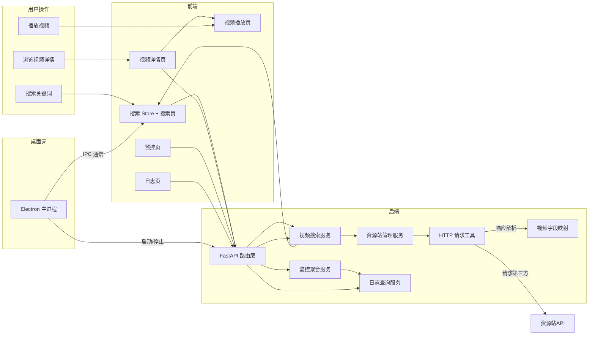
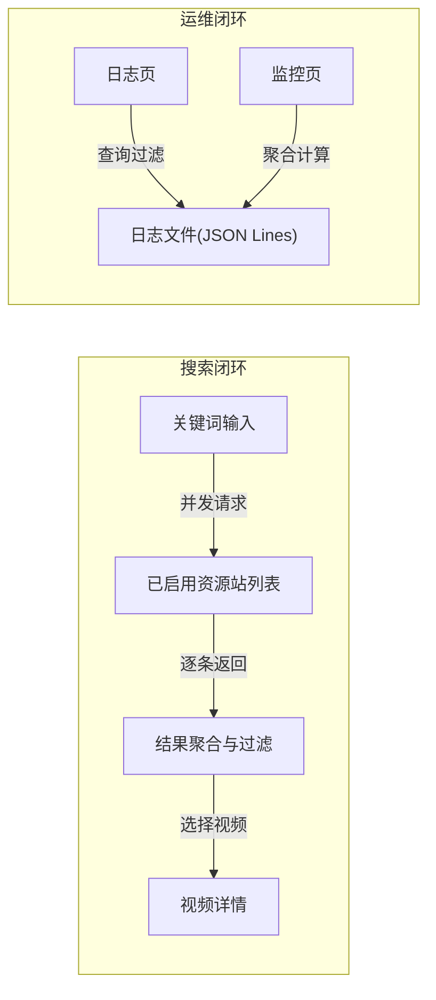
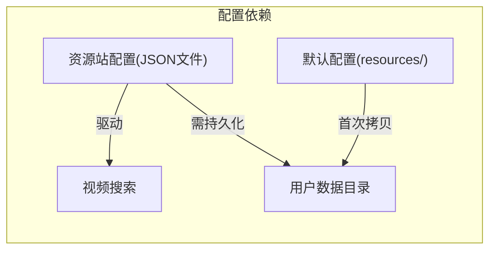

# VideoSearch — 模块说明文档

> 本文档说明系统的业务功能设计、模块边界和协作关系。
> `doc/项目结构文档.md` 负责说明代码组织，本文档负责说明业务模块如何支撑产品能力。
> 更新日期：2026-07-19

---

## 1. 文档定位

本文档面向参与 VideoSearch 开发的工程师，帮助理解系统的业务模块划分、各模块的职责边界以及模块间的协作关系。阅读前建议先了解 `doc/项目结构文档.md` 中的代码组织结构，再通过本文档理解各模块的业务语义。两个文档互补：一份回答"代码如何组织"，一份回答"业务边界在哪里"。

## 2. 系统功能定位

VideoSearch 是一个桌面端视频聚合搜索工具，帮助用户在一个界面内通过关键词同时搜索多个第三方视频资源站，聚合展示结果、查看视频详情、选择播放源。

系统围绕以下核心能力方向设计：

| 能力方向 | 业务目标 |
|---------|---------|
| 多源聚合搜索 | 一次输入，并发查询所有已启用资源站，聚合结果供用户对比选择 |
| 资源站管理 | 灵活启停、测试可用性、配置资源站的 API 参数 |
| 视频元信息展示 | 展示海报、演员、简介、播放源分组等信息，辅助用户决策 |
| 播放源解析 | 从资源站响应中解析不同格式（m3u8/mp4等）的播放 URL |
| 运行监控 | 基于本地日志聚合搜索趋势、站点性能、热门关键词，辅助运维判断 |

## 3. 端侧职责划分

| 端侧 | 职责定位 | 设计关注点 |
|------|---------|-----------|
| 桌面壳（Electron） | 窗口管理与后端进程生命周期编排 | 后端子进程的启动、健康检查、优雅关闭；窗口控制（最大化/最小化/无边框）；IPC 桥接 |
| 前端界面（Vue 3） | 用户交互与状态管理 | 多站点搜索结果并发展示、Tab 切换、分页、本地缓存恢复；响应式布局 |
| 后端服务（FastAPI） | RESTful API 提供服务 | 资源站配置 CRUD、第三方 HTTP 请求封装、日志聚合统计 |
| 外部资源站 | 第三方视频数据源（JSON API） | 多站点异构接口适配（参数字段映射、响应结构解析、格式识别） |
| 本地文件系统 | 持久化资源站配置与 JSON Lines 日志 | 配置读写异常处理、日志轮转与清理 |

## 4. 功能模块总览

| 模块 | 定位 | 核心产出 |
|------|------|---------|
| 视频搜索 | 系统的核心业务入口 | 多站点并发搜索结果聚合与展示 |
| 资源站管理 | 视频搜索的数据源配置 | 站点列表、配置持久化、连接测试 |
| 视频详情与播放 | 搜索结果的下游消费 | 元信息展示、播放源解析与分组 |
| 系统监控 | 运行状态聚合分析 | 仪表板概览、趋势图表、站点性能、热门关键词 |
| 系统日志 | 运维支撑 | 日志浏览、过滤、统计、清理 |
| 桌面壳 | 应用载体 | 窗口管理、后端进程编排、IPC 通信 |

## 5. 各业务模块说明

### 5.1 视频搜索模块

**定位**：用户输入关键词后，系统并发向所有已启用资源站发起搜索请求并聚合返回结果。

**核心功能**：
- 输入关键词并校验是否为空
- 从资源站管理模块获取所有已启用的站点列表
- 同时向所有已启用站点发起异步 HTTP 请求（并发模式，逐个返回结果）
- 过滤非法类型（预告片、电影解说、影视解说）
- 对原始响应字段进行映射转换（`vod_id`、`vod_name`、`vod_pic` 等 → 统一结构）
- 支持单站翻页搜索
- 前端 2 小时搜索缓存（`localStorage`）恢复

**设计边界**：
- 只负责搜索请求的分发和结果聚合，不负责视频播放源的直接渲染
- 搜索结果的过滤仅限于类型名称过滤，不涉及内容层面的审核或排序
- 不维护搜索历史，前端本地缓存只是方便页面刷新后恢复上次搜索状态

**关联模块**：资源站管理（获取站点配置）、视频详情与播放（消费搜索结果）

**开发关注点**：
- 并发搜索的请求超时和异常隔离很重要，一个站点超时不阻塞其他站点
- 第三方资源站的 API 响应结构差异较大，`video_mapper` 中的字段映射逻辑需持续适配
- 搜索结果的分页信息依赖资源站返回的 `total` 字段，该字段在不同站点中位置不同
- `localStorage` 缓存恢复时需校验过期时间

### 5.2 资源站管理模块

**定位**：管理第三方视频资源站的配置清单，控制哪些站点参与搜索。

**核心功能**：
- 从本地 JSON 配置文件加载资源站列表（默认从项目 `resources/resource_sites.json` 拷贝到用户数据目录）
- 切换单个站点的启用/禁用状态
- 对指定站点进行连接测试（随机选取测试关键词，校验响应结构）
- 批量测试所有已启用站点
- 持久化修改后的配置到用户数据目录

**设计边界**：
- 不负责资源站的增删改（用户无法通过 UI 新建或删除站点，只能启停已有站点）
- 连接测试只验证 API 连通性和响应结构是否符合预期，不验证视频内容可用性
- 配置异常时回退方式明确：优先使用用户目录的可写副本，不存在则从默认配置拷贝

**关联模块**：视频搜索（提供站点列表和启停状态）

**开发关注点**：
- 配置文件 I/O 异常需妥善处理（读写失败时不能使后端崩溃）
- 连接测试的响应校验逻辑需平衡——过严会误判，过松会放过不可用站点
- 并发进行批量测试时需控制请求频率，避免对第三方站点造成压力
- `_validate_response_content` 中检测反爬机制的规则需要随着第三方站点的变化而更新

### 5.3 视频详情与播放模块

**定位**：展示选定视频的元信息，解析并分发播放源。

**核心功能**：
- 通过二次搜索定位视频详情（根据关键词重新搜索后按 `vod_id` 匹配）
- 展示视频元信息：海报、标题、简介、演员、地区、语言、年份、状态
- 按格式（m3u8/mp4/flv）对播放源进行分组展示
- 支持 HLS.js 流媒体播放和普通 URL 直链播放
- 剧集列表切换（右侧面板）

**设计边界**：
- 详情获取不依赖独立详情 API，而是通过重新搜索+ID 匹配实现——这是对第三方资源站接口形态的妥协
- 播放器只负责 URL 级别的播放，不处理 DRM、字幕、倍速等高级播放器功能
- 播放源 URL 的有效性不在此模块验证（由用户点击时实际加载判断）

**关联模块**：视频搜索（提供搜索结果作为详情数据的来源）

**开发关注点**：
- 详情获取依赖二次搜索，搜索效率较低，长视频列表时需考虑优化
- 播放源 URL 的格式识别逻辑（`_identify_play_format`）需要覆盖更多第三方格式
- HLS.js 的初始化时机和清理需要在 Vue 组件生命周期中妥善管理
- `play_sources` 的数据结构在不同资源站之间有差异，`normalizePlaySources` 需要兼容数组和对象两种格式

### 5.4 系统监控模块

**核心功能**：
- 仪表板概览：活跃用户数、搜索次数、成功率、平均响应时间、错误数
- 按小时聚合的搜索趋势（柱状图）
- 站点性能表格（请求数、成功率、平均响应时间）
- 热门关键词排名
- 系统健康状态（基于错误数和警告数判定 healthy/warning/error）
- 30 秒自动刷新

**设计边界**：
- 所有数据基于本地 JSON Lines 日志聚合，不依赖外部监控系统
- 数据的实时性受限于日志写入时机，非严格实时
- 监控数据的准确性依赖日志记录的完整性——日志被清理后历史数据消失

**关联模块**：系统日志（作为数据来源）

**开发关注点**：
- 日志聚合计算发生在每次 API 请求时，大量日志下性能需关注
- 趋势数据的小时桶逻辑在跨天时正确处理
- 热门关键词的提取依赖 URL Query 解析，不同资源站的参数名不同
- 前端自动刷新需在组件销毁时清除定时器

### 5.5 系统日志模块

**核心功能**：
- 日志列表浏览（支持分页）
- 多维度过滤：日志类型（system/request/operation）、级别（INFO/WARNING/ERROR）、时间范围、关键词搜索
- 日志统计：按类型和级别汇总数量
- 日志清理（支持同时清理轮转备份）
- JSON Lines 格式日志解析与渲染

**设计边界**：
- 只读取和展示日志，不写入日志（日志写入由 `core/logging.py` 统一管理）
- 日志文件采用轮转策略（RotatingFileHandler），单个文件超过阈值后自动备份
- 清理操作不可恢复，需用户确认

**关联模块**：系统监控（作为底层数据源被监控模块读取）

**开发关注点**：
- 日志文件可能很大，分页和过滤必须在前端读取时完成而非在内存中全量加载后筛选
- 轮转备份的日志文件需要被纳入读取范围
- 日志行解析需容错（单行 JSON 解析失败不影响其他行）
- `filter_log_entries` 的关键词匹配使用全量 JSON 字符串检索，性能需关注

### 5.6 桌面壳模块

**核心功能**：
- 创建和管理无边框应用窗口（1280×820，最小 1024×680）
- 启动后端 FastAPI 子进程（开发环境使用 `uvicorn`，打包后从 `backend.exe` 启动）
- 后端健康检查轮询（最长等待 15 秒）
- 后端进程的优雅关闭（`before-quit` 事件拦截）
- IPC 通信：应用信息、后端地址、窗口控制、窗口状态变更通知
- 预加载脚本通过 `contextBridge` 暴露桌面 API 到渲染进程

**设计边界**：
- 不参与前端业务逻辑，职责仅限于进程编排和窗口管理
- 后端进程管理假设单实例运行，不处理多实例冲突
- 无边框窗口的拖拽区域通过 CSS `-webkit-app-region` 标记实现

**关联模块**：所有其他模块（作为载体提供运行环境）

**开发关注点**：
- 后端进程的启动路径需区分开发环境和打包后的路径，处理不当会导致应用崩溃
- 健康检查的超时和重试策略需要平衡用户体验和后端启动时间
- 窗口关闭时需先等待后端进程停止再退出，`before-quit` 事件处理需防重入
- 预加载脚本中的 IPC 通道需保持与前端的约定一致

## 6. 通用支撑能力

| 能力 | 职责 | 使用原则 |
|------|------|---------|
| 统一 HTTP 请求工具 | 封装 `httpx` 的 GET 请求，自动记录请求日志、计时、异常转换 | 视频搜索和连接测试均通过此工具发送请求；工具内部已覆盖超时、HTTP 错误、解析失败等场景 |
| 视频字段映射工具 | 解析第三方资源站异构响应，提取视频条目、播放源、总数 | 所有搜索结果的字段转换都经过此工具；适配新资源站时优先修改映射规则而非调用侧 |
| 统一响应与错误处理 | 定义 `ApiResponse`/`PaginatedResponse`/`ErrorCode` 和 `success()`/`error()` 构造器 | API 层必须使用统一返回方式，禁止裸 JSON 响应 |
| JSON Lines 日志系统 | 为整个应用提供结构化日志（JSON Lines 格式），支持日志轮转、请求日志记录 | 开发时应避免：手动拼接日志字符串、在非日志模块中直接处理日志文件 I/O |
| 通用前端组件 | `AppAlert`/`AppEmptyState`/`AppLoadingState`/`AppPagination` 四种基础 UI 组件 | 页面中的空状态、加载中、错误提示、分页控制应优先使用这些组件而非自建 |
| Axios 请求封装 | 统一配置 `baseURL`、超时、请求/响应拦截器，支持 Electron 预加载环境 | 请求层自动适配开发环境（Vite 代理）和桌面环境（preload 注入地址），业务组件不应关心地址来源 |
| 前端状态管理 | `useResourceStore`/`useSearchStore`/`useVideoStore` 三个 Pinia Store 聚合业务状态 | Store 是业务的单点入口，组件内的局部状态不应扩散到 Store；搜索缓存由 Store 统一管理 |

## 7. 模块间关键关系

**图说明**：主搜索流程从前端触发，后端请求资源站 API 并通过字段映射工具转换响应，结果逐条返回前端展示；监控和日志基于同一日志文件，分别支撑运维和开发调试视角；桌面壳负责整个应用的进程编排。

**图说明**：搜索闭环的核心是"并发请求-聚合展示"模式，运维闭环的核心是"一次写入、多次读取"的日志消费模式。

**图说明**：资源站配置是搜索功能的驱动数据，配置文件从默认路径首次拷贝到用户数据目录后即可读写。

## 8. 典型业务闭环

### 闭环一：搜索并浏览视频

1. 用户在搜索页输入关键词，点击搜索
2. 前端 `useSearchStore` 从 `useResourceStore` 获取所有已启用站点列表
3. 同时对每个站点发起 `/api/v1/videos/search` 请求
4. 后端按站点逐一返回搜索结果（每个站点独立触发前端更新）
5. 前端按站点 Tab 展示结果列表，支持在单个站点内翻页
6. 用户点击结果卡片进入视频详情页
7. 前端 `/api/v1/videos/detail` 接口根据关键词重新搜索并按 ID 匹配到目标视频
8. 展示视频元信息和按格式分组的播放源

### 闭环二：管理资源站与连接测试

1. 用户在设置页查看当前资源站列表及统计（总站点数/启用/禁用）
2. 可对单个站点进行启用/禁用切换
3. 可对单个站点或全部已启用站点进行连接测试（随机选取关键词校验响应）
4. 测试结果实时展示（成功/失败、响应时间、响应大小）
5. 配置变更自动保存到用户数据目录的 JSON 文件，重启后保持

### 闭环三：系统运行监控

1. 用户进入系统监控页，选择时间窗口（6/24/72 小时）
2. 后端按时间窗口从本地 JSON Lines 日志中聚合数据
3. 展示概览卡片：搜索次数、成功率、平均响应时间、错误数
4. 展示每小时聚合的搜索趋势柱状图
5. 展示各资源站的性能表格（请求数、成功率、平均响应时间）
6. 展示热门搜索关键词排名
7. 支持手动刷新和 30 秒自动刷新

### 闭环四：日志查阅与清理

1. 用户进入系统日志页，可浏览按时间倒序排列的日志列表
2. 支持按类型（system/request/operation）、级别（INFO/WARNING/ERROR）、时间范围和关键词过滤
3. 可查看日志统计概览（各级别、各类型的数量分布）
4. 用户可执行日志清理（可选择是否同时清理轮转备份文件）
5. 清理操作不可撤销

## 9. 后续开发参考原则

1. **新资源站优先适配字段映射，不动调用链路**：第三方资源站的不同之处在于响应字段名和播放源编码格式，第一修改点应是 `video_mapper.py`，而非视频搜索服务或 API 层
2. **并发请求的失败不阻塞整体**：一个资源站超时或返回异常不应中断其他站点的搜索结果，也不应阻塞整个页面的响应
3. **播放源格式识别规则保持可扩展**：`_identify_play_format` 中的格式特征列表应随接入的新格式持续追加，而非在发现新格式时重写整个函数
4. **日志是监控的唯一数据源**：监控模块不应绕过日志直接记录运营数据；如需更多维度的监控数据，应先在日志格式中扩展字段
5. **配置读写路径固定，不散落在各处**：资源站配置的读写入口只有 `services/resources.py` 中的 `load_resource_config` 和 `save_resource_config`，新功能需要读取配置时应复用它而非自行解析 JSON
6. **前端的搜索缓存只恢复状态，不恢复搜索请求**：`localStorage` 的 2 小时缓存只恢复上次搜索的关键词和结果结构，不自动重新发起搜索请求——用户需要手动点击搜索
7. **播放器的状态管理保持在组件内**：播放相关的状态（当前播放 URL、播放进度等）保持在 `VideoPlayer.vue` 组件内部，不提升到 `useVideoStore`
8. **预加载脚本保持轻量**：`electron/preload/index.js` 只做 IPC 暴露和上下文桥接，不包含任何业务逻辑
9. **文件 I/O 异常必须有兜底**：配置文件和日志文件的读写操作必须被 try-except 保护，失败时不能使后端进程退出
